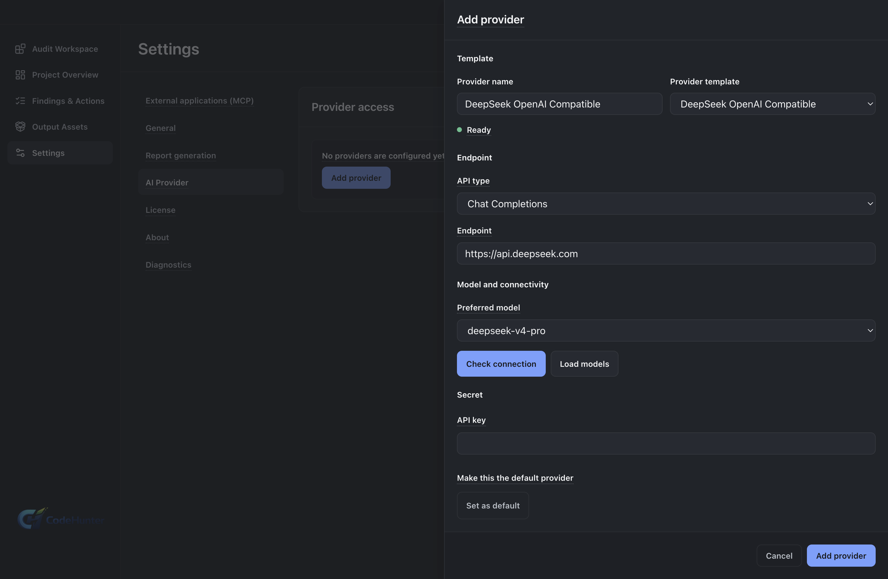
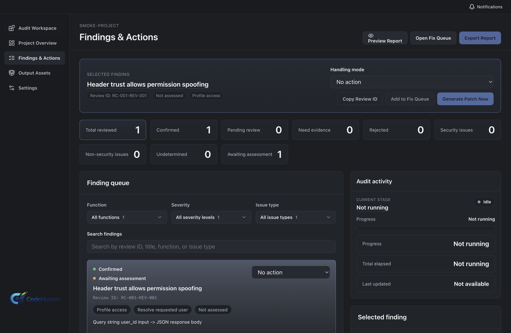

# Code Hunter Personal — Complete User Guide

Follow this guide from top to bottom for a complete Personal audit. Required steps establish the project and audit result. Conditional steps apply when you need a report or remediation. Personal MCP and appearance settings are optional.

Screenshots show the product workflow. Production activation and account entitlement are handled by the official service.

## Workflow at a glance

| Order | Stage | Type | Completion signal |
| --- | --- | --- | --- |
| 1 | [Install and activate Personal](#get-started) | Required | The License page shows Personal access |
| 2 | [Configure the provider and model roles](#provider) | Required | The provider test succeeds and a default is selected |
| 3 | [Choose Personal settings](#personal-settings) | Optional | Language, theme, report behavior, and advanced fields match your needs |
| 4 | [Import the project and define scope](#project-and-audit) | Required | The repository root and exclusions are saved |
| 5 | [Choose audit depth and model assurance](#audit-choices) | Required | The run shows the intended depth, assurance, Auditor roster, and Reviewer |
| 6 | [Build project understanding and run the audit](#run-controls) | Required | Project Profile, Feature Inventory, risk analysis, and Finding review complete |
| 7 | [Review findings and evidence](#findings-and-evidence) | Required | Each promoted Finding has a human decision |
| 8 | [Save the report](#reports-and-fixes) | Conditional | The reviewed Findings appear in the exported report |
| 9 | [Generate, apply, and test a scoped fix](#fix-package) | Conditional | The patch is reviewed, tested, and either kept or rolled back |
| 10 | [Connect Personal MCP](#personal-mcp) | Optional | A scoped external client can read approved project material |

## Step 1 — Download, start, and activate Personal

**Purpose:** install the correct edition and establish the access state used by the desktop app.

1. Download Personal from the [official Code Hunter download center](https://www.arvantacyber.com/code-hunter/download/).
2. Install and start the Personal desktop app.
3. Open **Settings → About** and confirm that the running edition is Personal.
4. Open **Settings → License**.
5. Choose the activation action shown by the app and complete the official service step.
6. Return to the desktop app and choose **Validate** or **Refresh**.
7. Use **Deactivate** only when access must move to another device.

**Result:** the License page shows the current Personal access state. A development activation screen demonstrates the UI path but does not grant a production entitlement.

**Common problem:** if access remains pending, finish the official service step for the same device, return to the same Personal instance, and refresh License.

## Step 2 — Configure the model provider

**Purpose:** supply the model used for project understanding, security analysis, Finding review, report preparation, and fix assistance.

1. Open **Settings → AI Provider**.
2. Choose the provider preset that matches the service you use.
3. Confirm the **API type**: Chat Completions or Responses.
4. Enter the **Endpoint / Base URL**.
5. Select or enter the exact model name accepted by the provider.
6. Enter the API key in the protected credential field.
7. Choose **Check connection** and, when supported, **Load models**.
8. Save the provider.
9. Set it as the default provider after the test succeeds.
10. Reopen it and confirm that the non-secret settings persisted.

**Result:** the provider appears in the saved list, its connection test succeeds, and Personal has a default model for normal stages.

**Common problem:** check the Base URL for connection errors, the model name for model errors, and the credential for authentication errors. Saving a provider and testing it do not automatically assign its model roles.

### Provider terms and status

| Term | Meaning |
| --- | --- |
| **Provider preset** | A template that pre-fills the API type, common endpoint, and model information |
| **Ready** | The template can be configured and tested directly |
| **Template only** | The fields are provided, but you must supply the real connection details |
| **Adapter required** | The service needs a compatible adapter; do not assume direct connectivity |
| **Chat Completions** | Uses a compatible Chat Completions API surface |
| **Responses** | Uses a Responses API surface and can expose reasoning effort for compatible models |
| **Default provider** | The primary provider used by normal single-model stages |
| **Auditor** | A model role that independently produces a candidate result during cross-model assurance |
| **Reviewer** | The model role that merges Auditor results, resolves disagreements, and produces the final result |

### Configure Auditor and Reviewer roles

1. Save and test every provider profile that will participate in the run.
2. Select a provider and choose **Add auditor** to add it to the ordered Auditor roster.
3. Add other tested profiles when you want independent candidate results.
4. Move Auditors up or down to set their execution order.
5. Select the tested profile that will adjudicate results and choose **Set as reviewer**.
6. Reopen **Settings → AI Provider** and confirm the roster and Reviewer.

Auditors run independently in roster order; the product does not expose a parallel-Auditor switch. The Reviewer runs after the candidates and forms the final contract. For meaningful cross-model independence, prefer different tested models or providers. Assigning the same profile to multiple roles does not create independent coverage.

### Reasoning effort

Reasoning effort controls one compatible model call. It does not replace Audit depth or Model assurance.

| Option | Use |
| --- | --- |
| **Provider default** | Keep the provider or model default behavior |
| **Low** | Prefer speed for connectivity checks or simpler scopes |
| **Medium** | Balance speed and depth for normal use |
| **High** | Prefer deeper reasoning; expect longer calls and usually more provider usage |

## Optional setup — Language, theme, provider details, and report behavior

Open **Settings → General** before the first audit when you want to change the workspace behavior.

- **Interface language** changes the desktop interface.
- **Default output language** applies to new outputs that have not locked a run language. Existing or active artifacts keep their original run language.
- **Workspace theme** changes the visual style. Available themes are Graphite, Sandstone, Porcelain, Sage, Cobalt, Aurora, and Rose.
- **Open the report folder after completion** opens the output directory when generation finishes.
- **Show advanced provider options** exposes additional headers, query parameters, or provider-specific transport configuration. Leave it off unless the provider requires those fields.

1. Choose the language, output language, and theme.
2. Enable only the behavior options you need.
3. Choose **Apply changes**.

### Control model information in reports

Open **Settings → Report generation**.

- When **Include model information in reports** is enabled, new or regenerated reports include model, provider, model-role, and generation provenance.
- When it is disabled, new or regenerated reports omit that provenance while retaining Findings, evidence, conditions, limitations, human decisions, and conclusions.
- Saved reports are not rewritten automatically.
- Facts about an AI or model system being audited remain part of the security content; the switch only controls Code Hunter generation provenance.

## Step 3 — Import the project and define the audit scope

**Purpose:** tell Personal which source tree belongs to the audit and which files should stay outside model context.

1. Open **Audit Workspace** and choose **Import Project**.
2. Select the repository root, not a nested source, build, cache, or dependency directory.
3. Give the project a clear name.
4. Confirm the source path and workspace path shown by the app.
5. Exclude dependencies, generated code, caches, build output, large vendored trees, out-of-scope fixtures, and unrelated repositories.
6. Select the project language when it is not detected correctly.
7. Save the project and reopen it to confirm that the path and exclusions persisted.

**Result:** the project points to the intended repository root and has a bounded audit scope.

**Common problem:** correct the project root and exclusions before choosing a deeper audit. More analysis passes cannot repair an incorrect source scope.

## Step 4 — Choose Audit depth and Model assurance

Three separate controls affect model execution:

| Control | What it changes |
| --- | --- |
| **Reasoning effort** | Speed, connection time, and reasoning depth of one compatible model call |
| **Audit depth** | Which contract stages receive additional refinement and reverse-coverage passes |
| **Model assurance** | Which stages use multiple model candidates and Reviewer adjudication |

### Choose one of five Audit depth options

| Audit depth | Execution behavior | Good starting point |
| --- | --- | --- |
| **Standard** | Runs the standard generation and review flow without extra refinement passes | First audit, scope validation, and normal projects |
| **Base Advanced** | Adds one refinement pass to Project Profile and Feature Inventory | Improve project understanding without adding passes to every stage |
| **Base Deep** | Adds refinement and reverse-coverage checks to Project Profile and Feature Inventory | Complex projects where entries or features may be missed |
| **Full Advanced** | Adds one refinement pass to every contract stage | Broad review of a critical project |
| **Full Deep** | Adds refinement and reverse-coverage checks to every contract stage | Highest-depth review; usually the longest and most provider-intensive |

**Foundation** means Project Profile and Feature Inventory. An **advanced refinement** checks and corrects the current stage result. A **reverse-coverage check** works back from source, features, and risks to look for omissions. These passes apply to audit contract stages; exporting a report does not repeat all of them.

### Choose one of four Model assurance options

| Model assurance | Execution behavior | Required setup |
| --- | --- | --- |
| **Single model** | Uses the primary model for the normal audit | One tested default provider |
| **Standard assurance** | Uses a Reviewer for final Finding assurance and Fix Package review | A tested Reviewer |
| **Risk assurance** | Uses cross-model candidates and consensus for Generic Risk, Business Risk, and Finding Review | An Auditor roster and Reviewer |
| **Full cross-model deep audit** | Uses independent candidates and Reviewer consensus at every contract stage | A complete Auditor roster and Reviewer; expect the highest model usage |

For the first run, use **Standard + Single model** to confirm that the project root, exclusions, provider, Project Profile, and Feature Inventory are correct. Increase depth or assurance after the foundation is reliable. If Reviewer setup is incomplete, return to **Settings → AI Provider** or select **Single model**.

## Step 5 — Build project understanding and run the security audit

**Project Profile** is the structured description of the project purpose, architecture, entry points, boundaries, and external dependencies. **Feature Inventory** is the list of product functions, entry points, permissions, and sensitive behaviors found in the selected source scope.

1. Start the selected audit.
2. Review Project Profile and Feature Inventory.
3. Check entry points, trust boundaries, authentication, authorization, sensitive data, external calls, privileged operations, and business-critical functions.
4. Correct the project scope when important modules are missing or generated files dominate the inventory.
5. Run Generic Risk analysis.
6. Run Business Risk analysis when the project contains state, money, approval, tenant, identity, or other business-sensitive flows.
7. Complete Finding Review.
8. Open **Findings & Actions**.

### Understand the workspace actions

| Action | Actual effect |
| --- | --- |
| **Rescan Workspace** | Re-reads the workspace and saved file state; it does not rerun the AI audit |
| **Update Foundation Info** | Force-runs Project Profile and Feature Inventory so the foundation matches current source |
| **Resume selected audit** | Continues from the backend's unfinished or failed stage and keeps completed stages |
| **Resume from stage** | Continues from the recovery point displayed by the app |
| **Restart / full restart** | Starts a complete audit again with the current scope and choices |
| **Refresh** | Reloads visible state; it does not start analysis |

Use **Update Foundation Info** when the project has added an authentication module or substantially changed structure but the existing Feature Inventory still describes the old source. Continue with risk analysis only after the refreshed foundation is correct. Some actions are disabled while another run is starting or active.

**Result:** the project has a reviewable foundation and candidate Findings connected to product behavior.

## Step 6 — Review Findings and evidence

**Severity** describes potential impact. **Confidence** describes how strongly the current evidence supports the conclusion. A high severity with weak evidence still requires investigation.

1. Open **Findings & Actions**.
2. Select a Finding.
3. Check Severity and Confidence.
4. Read the affected behavior and source location.
5. Open **Proof / Evidence**.
6. Follow the source, transit, sensitive operation, and missing-control evidence when available.
7. Confirm that the behavior is reachable in the imported project and scope.
8. Choose the appropriate human decision:
   - **Accept** confirms the risk and evidence.
   - **Reject** records that the candidate does not hold after review.
   - **Downgrade** records that the issue exists but its current severity is too high.
   - **Defer** schedules later evidence or work without treating the issue as fixed.
9. Record the reason and save.

**Proof / Evidence** binds a conclusion to source locations, behavior, data flow, conditions, and missing controls. Keep incomplete evidence unconfirmed and rerun the relevant analysis after correcting scope or foundation.

## Step 7 — Produce the reviewed report

1. Select the reviewed Findings to include.
2. Open the report preview.
3. Check Severity, decision state, evidence, affected files, impact, and remediation direction.
4. Remove items that have not completed human review.
5. Save or export the report.
6. Open the saved report and confirm that the selected Findings are present.

**Result:** the report contains the intended reviewed Findings instead of every raw candidate.

**Common problem:** if a Finding is missing, return to Findings, save its human decision, and include it in the report selection.

## Step 8 — Generate, apply, test, and close a Scoped Fix Package

A **Scoped Fix Package** is repair material limited to the selected Finding and file scope. Generating it does not apply the patch and does not prove the vulnerability is fixed.

1. Select the confirmed Finding or bounded Finding set.
2. Choose **Generate scoped fix package**.
3. Review affected files, patch scope, assumptions, test command, and rollback instructions.
4. Check the source worktree. Save or commit unrelated work before applying the package.
5. Review the patch.
6. Apply the package.
7. Run the project's real tests.
8. Inspect the Git diff and confirm that unrelated files did not change.
9. Keep the fix when review and tests pass.
10. Use the recorded rollback path when the result is not acceptable, then confirm that the source returned to its prior state.
11. Update the Finding or report with the final remediation result.

**Result:** the Finding has a bounded patch, test evidence, and a clear kept-or-rolled-back outcome.

**Common problem:** if the package is too large, reduce the selected Finding scope and generate another package. Do not apply unrelated changes.

## Optional — Connect Personal MCP

Personal MCP is a local STDIO bridge exposed by the running Personal desktop. It is not a model Provider and cannot connect to Team.

1. Keep the matching Personal desktop instance running.
2. Open **Settings → External Apps / MCP**.
3. Enable external application connections.
4. Create a connection name.
5. Choose **Read only** or **Developer collaboration**.
6. Select the Personal projects the connection may access.
7. Choose whether reports, evidence, and repair material may be returned.
8. Create the connection and copy the Codex or general MCP configuration.
9. Add the configuration to the external client.
10. List authorized projects and read the allowed snapshots, Findings, reports, or repair material.
11. Review pending work requests in Personal before starting them.
12. Check request history and revoke the connection when no longer needed.

**Boundary:** Personal MCP cannot import arbitrary projects, run arbitrary commands, bypass desktop confirmation, or use a Team connection.

## Troubleshooting by stage

| Problem | Check |
| --- | --- |
| License remains pending | Finish the official service step, return to the same Personal instance, and refresh License |
| Provider is unavailable | Test Base URL, model, credential, API type, and network access |
| Cross-model run cannot start | Configure a tested Reviewer and Auditor roster, or select Single model |
| Imported path is wrong | Remove the project entry and import the repository root |
| Results are too broad | Fix exclusions and project foundation before increasing depth |
| Update Foundation Info is unavailable | Wait for the active or launching run to finish |
| Report misses a Finding | Save the human decision and include the Finding in the report selection |
| Report still shows old provenance | Regenerate it; the setting does not rewrite an already saved report |
| Fix Package is too large | Reduce the selected Finding scope and regenerate |
| MCP cannot connect | Keep the matching Personal instance running and recreate the scoped STDIO configuration |

## Personal closure checklist

- Personal is activated and the edition is correct.
- The default provider passes its test.
- Any Auditor roster and Reviewer required by Model assurance are ready.
- The repository root, exclusions, language, Audit depth, and Model assurance are saved.
- Project Profile, Feature Inventory, and required analysis stages completed.
- Every reported Finding has a human decision and evidence review.
- The report opens and contains the intended Findings.
- Every applied fix has a reviewed diff, test result, and rollback path.
- Any Personal MCP connection is scoped to named projects and can be revoked.
