# Code Hunter Team — Complete User Guide

This guide follows the Team delivery path from installation to a governed release decision: activate Team, enter a workspace, assign roles, connect source code, create a baseline and iteration, analyze change, review findings and dependencies, assign remediation, collect test evidence, verify the fix, decide release readiness, and promote a fresh baseline. Developer Agent, CLI, IDE, external reports, SCA, and Team MCP are placed at the stage where they are actually used.

Screenshots show the product workflow. Production activation and account entitlement are handled by the official service.

The fine-grained screenshots in the configuration and Analysis Center sections are real Electron renderer captures from a test workspace. Their labels follow the locale active during capture; they document the available controls and state transitions, not production entitlement, native IDE behavior, or a successful release decision.

## Workflow at a glance

| Order | Stage | Required? | Completion signal |
| --- | --- | --- | --- |
| 1 | [Install, activate, and enter a workspace](#get-started) | Required | Team opens the intended workspace |
| 2 | [Add members and roles](#workspace-and-roles) | Required for collaboration | Reviewer, owner, developer, and remediation responsibilities are assigned |
| 3 | [Configure and test a provider](#provider) | Required for AI-assisted stages | The default provider test succeeds |
| 4 | [Create a project and connect code](#project-and-code-source) | Required | The SCM or local source test succeeds and the intended revision is selected |
| 5 | [Configure project connectors](#team-connectors) | Conditional | Required external requirement, CI, or notification connections pass a real test |
| 6 | [Initialize the baseline](#baseline-and-iteration) | Required | The project has a materialized starting state |
| 7 | [Create an iteration and bind work](#baseline-and-iteration) | Required | Requirements and code changes point to the intended revision |
| 8 | [Import and review requirements](#requirements) | Required when the delivery has requirement input | Requirement Sources become reviewed, traceable requirements |
| 9 | [Run requirement, change, risk, and Finding analysis](#analysis-and-findings) | Required | Reviewable iteration Findings are available |
| 10 | [Import external SAST/SARIF](#analysis-and-findings) | Optional | External Findings are normalized and reviewed |
| 11 | [Run SCA](#sca-and-release-gate) | Conditional on dependency or license policy | Components, advisories, licenses, and exceptions are evaluated |
| 12 | [Assign Findings and create remediation tasks](#remediation-and-verification) | Required for closure | Each accepted issue has an Owner and acceptance criteria |
| 13 | [Use desktop, Developer Agent CLI, or IDE Inbox](#developer-tools) | Optional execution surface | A claimed task produces a reviewed patch or PR/MR |
| 14 | [Bind CI evidence and verify the fix](#remediation-and-verification) | Required for verified closure | Evidence matches the submitted commit and verification completes |
| 15 | [Decide release readiness and promote the baseline](#release-readiness) | Required for the governed release loop | The release has a recorded state and the accepted release becomes the next Baseline |
| 16 | [Connect Team MCP](#team-mcp) | Optional | A scoped member/project connection can submit reviewable requests |

<a id="get-started"></a>
## Step 1 — Download, activate, and enter Team

**What this stage does:** starts the correct desktop edition and opens the workspace that owns later project and release records.

1. Download Team from the [official Code Hunter download center](https://www.arvantacyber.com/code-hunter/download/).
2. Install and start the Team desktop app.
3. Open **Settings → About** and confirm that the running edition is Team.
4. Open **Settings → License** and complete Team activation through the official service.
5. Return to Team and refresh the license state.
6. Open the workspace selector.
7. Select an existing workspace or create one when your role allows it.
8. Confirm that the workspace dashboard and its available projects load.

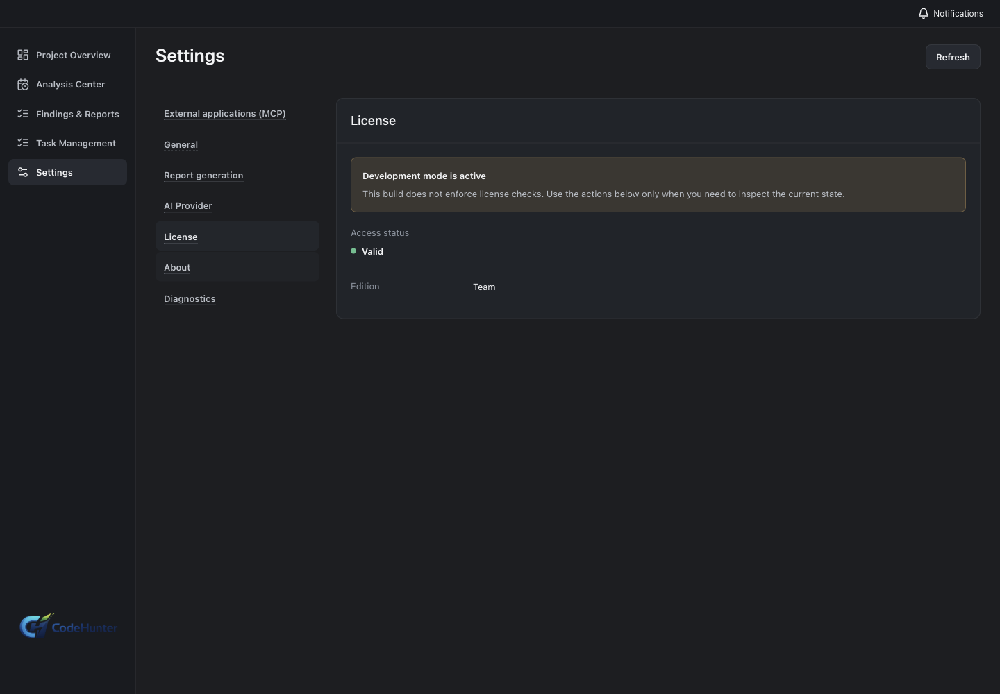

**Result:** Team shows an active access state and the intended workspace.

**If it fails:** confirm that the account belongs to the workspace, refresh License and workspace state, and check that the Team installation was opened instead of Personal.

<a id="workspace-and-roles"></a>
## Step 2 — Add members and assign roles

**What this stage does:** establishes who can review risk, own a project, perform remediation, and supply approvals.

1. Open the Team workspace.
2. Open **Members**.
3. Add the member account.
4. Assign the role needed by the workflow:
   - **Security Reviewer** reviews findings and security decisions.
   - **Project Owner** owns the project and its delivery policy.
   - **Developer** works on assigned remediation.
   - **Remediation Owner** owns closure and acceptance criteria.
5. Save the membership.
6. Assign the Project Owner and other project-scoped responsibilities.
7. Confirm that each required person can see the workspace or project surface associated with the role.

**Result:** the workspace has an explicit responsibility chain before findings and tasks are created.

**If it fails:** verify that the member is active and that the selected role is allowed for the project and action.

<a id="provider"></a>
## Step 3 — Configure the Team provider

**Purpose:** supply the model used by Requirement Extraction, impact analysis, security analysis, Finding review, report analysis, and remediation assistance.

1. Open **Settings → AI Provider**.
2. Choose the provider preset and confirm the API type.
3. Enter the Base URL, exact model, and protected API credential.
4. Save and test the provider.
5. Set it as default after the test succeeds.
6. Add tested profiles to the ordered Auditor roster when using cross-model assurance.
7. Set a tested profile as Reviewer.
8. Reopen the page and confirm that the non-secret settings, roster, and Reviewer persisted.

**Result:** Team analysis stages can select a tested provider.

**If it fails:** check the Base URL, exact model name, API type, credential, and network access. Provider credentials do not grant workspace membership or Developer Agent enrollment.

### Team model roles and execution order

| Term | Meaning |
| --- | --- |
| **Default provider** | The primary model used by normal single-model stages |
| **Auditor** | Produces an independent candidate result in cross-model stages |
| **Reviewer** | Merges candidates, resolves disagreements, and produces the final contract |
| **Workflow default** | Leaves Audit depth unset in the current launch form so the Team workflow uses its configured default |
| **Model assurance** | Controls which stages require model candidates and Reviewer adjudication |
| **Security Reviewer / Project Owner** | Human governance roles; they do not replace the model Reviewer |

### Model assurance choices

| Model assurance | Team behavior |
| --- | --- |
| **Single model** | Uses the primary model unless a governed Team workflow explicitly requires a review policy |
| **Standard assurance** | Adds Reviewer assurance to final Finding and Fix Package stages |
| **Risk assurance** | Adds cross-model candidates and consensus to risk and Finding stages |
| **Full cross-model deep audit** | Uses candidates and Reviewer consensus at every contract stage |

Reasoning effort controls a compatible model call, Audit depth controls extra refinement and reverse-coverage passes, and Model assurance controls model roles and consensus. Team workflows can require Reviewer or consensus checks for governed stages. Auditors run in roster order, and Team analysis stages run as a queue. Neither surface is presented as user-controlled parallel execution.

Use different tested models or providers when independent cross-model coverage matters. A provider can be saved and tested without being the default provider, an Auditor, or the Reviewer.

<a id="project-and-code-source"></a>
## Step 4 — Create a Team project and connect source code

**What this stage does:** creates the governed project and binds analysis to a real repository and revision.

1. Open **Team Projects** and choose **New project**.
2. Enter the project name.
3. Assign the Project Owner.
4. Set the default branch and release policy.
5. Save the project.
6. Open project source settings.
7. Create an SCM profile for GitHub, GitLab, or Bitbucket, or choose the supported local Git path.
8. Configure the authorized authentication method: bearer token, basic authentication, or SSH key.
9. Create the Code Source.
10. Test the connection.
11. Load available branches, tags, commits, and PR/MR references.
12. Select the source form used by this work: local Git, remote Git, patch-only, branch, tag, commit, or PR/MR.
13. Confirm the selected revision before continuing.


**Result:** the project has a tested source and a specific revision that can be materialized.

**If it fails:** a repository URL belongs in the Code Source. The revision field must contain a branch, tag, or commit that the repository can resolve. When connection succeeds but no refs appear, check repository permissions and the default branch.

### Team setup order inside a project

Complete the project configuration in this order before starting the first analysis:

1. Open **Project Overview** and confirm the selected project, branch, current Baseline, and current Iteration.
2. Open **Project Configuration → Repository** and verify the source and revision.
3. Open **Project Configuration → Requirements / CI connectors** and add only the integrations required by this project.
4. Open **Project Configuration → Developer & Agent** when developers will receive governed remediation tasks.
5. Open **Project Configuration → Default operator** and set the person whose identity should be prefilled for review decisions.
6. Open **Project Configuration → Analysis defaults** and review the defaults used by each Team analysis type.
7. Open **Policy Center** and verify the release gates, test allowlist, and forbidden command patterns.
8. Enter **Analysis Center** and create the Baseline, Iteration, SCA, external-report, requirement, or verification run that matches the work.

The controls are intentionally ordered this way: analysis reads the project source and policy, and an Iteration cannot be created until a ready Baseline exists.

### Step 4A — Open Project Overview

**What this page does:** shows the selected Team Project, its active branch, current Baseline, current analysis, input material, and the readiness cards that lead to configuration or analysis.

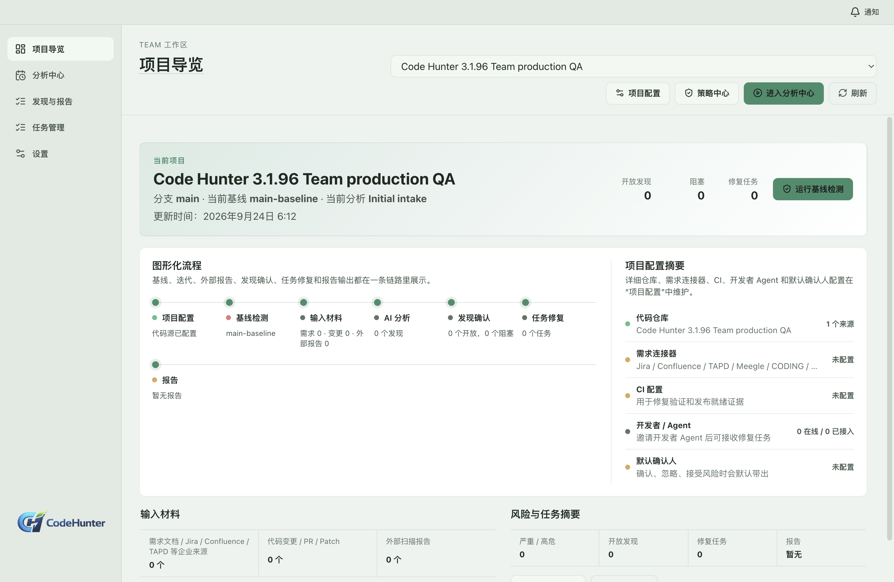

1. Choose the project from the selector at the top of the page.
2. Confirm the code repository card shows the intended source and branch.
3. Check the **Baseline**, **Input materials**, **AI analysis**, **Finding review**, **Remediation**, and **Report** cards.
4. Use **Project Configuration** to complete project-scoped setup, **Policy Center** to inspect gates, or **Enter Analysis Center** to run a workflow.

**Result:** you know which project and revision the next operation will affect. Cards marked `not configured`, `0`, or `none` are setup state, not a completed release decision.

**Common issue:** if the overview shows a different project or branch, change the project selector before opening any configuration drawer.

### Step 4B — Configure the repository

Open **Project Overview → Project Configuration → Repository**. This tab separates the repository connection from the revision used by an analysis.

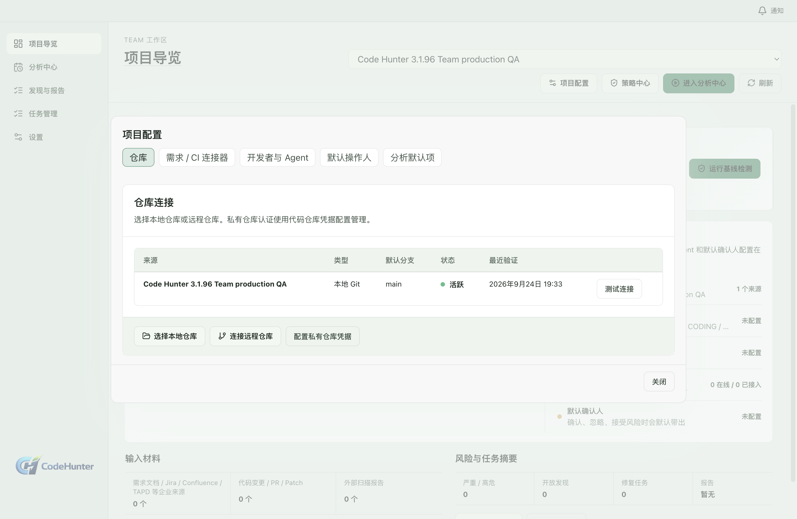

1. Use **Select local repository** for a local Git checkout, or **Connect remote repository** for a supported remote source.
2. For a private source, configure its SCM credentials in the protected credential flow. Do not paste credentials into a project name, revision, screenshot, or Markdown file.
3. Confirm the source row shows the expected type, default branch, active state, and last verification time.
4. Choose **Test connection** and wait for the result before selecting a Baseline or Iteration revision.

**Result:** the project can resolve the repository and its branch or commit. A repository URL identifies the source; a branch, tag, or commit identifies the revision.

**Common issue:** a successful connection with no refs usually means the SCM identity cannot read the repository or the default branch is wrong.

### Step 4C — Configure requirements and CI connectors

Open **Project Configuration → Requirements / CI connectors**. Requirement connectors provide input for an Iteration; CI connectors provide evidence for remediation and release readiness.

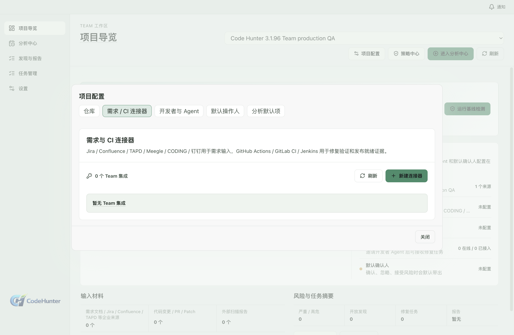

The current page lists requirement providers such as Jira, Confluence, TAPD, Meegle, CODING, and DingTalk, and CI providers such as GitHub Actions, GitLab CI, and Jenkins. Configure a connector only when the project uses that system.

1. Choose **New connector**.
2. Select the provider kind and enter a display name and Base URL.
3. Select the supported authentication method, then enter the provider-specific project, space, channel, repository, workflow, or job defaults.
4. Save the connector and choose **Test connection**. The test performs a remote request; it is not just a local field check.
5. Confirm the status is Active before importing requirements or CI evidence.

**Result:** an Iteration can import the intended requirement objects, and later verification can look up evidence for the correct repository and workflow.

**Common issue:** a connector may be saved but still unusable when its remote project scope is empty or its status is Failed. Never publish tokens or webhook URLs in screenshots or logs.

### Step 4D — Configure Developer & Agent

Open **Project Configuration → Developer & Agent** when the project will delegate remediation work to a local worker.

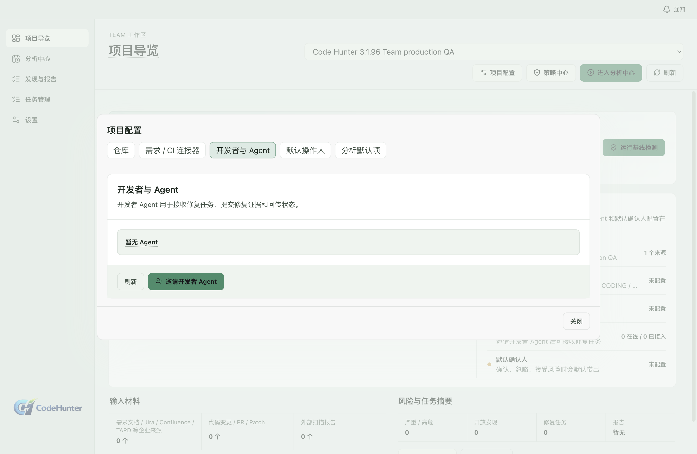

1. Choose **Invite Developer Agent**.
2. Create a one-time enrollment code in the Team desktop and give it only to the intended developer.
3. Enroll the local CLI from the bound repository and verify that `.codehunter/team-agent.toml` is created locally.
4. Return to this tab and refresh until the Agent is online and scoped to the intended project and repository.

**Result:** the Agent can receive assigned remediation tasks for this project. It is a local worker, not a Security Reviewer, risk approver, release approver, or Baseline administrator.

**Common issue:** an empty Agent list means the enrollment, repository binding, heartbeat, or project scope is incomplete. The enrollment code and Agent token must never enter source control.

### Step 4E — Set the default operator

Open **Project Configuration → Default operator**. This identity is a convenience default for review actions; it does not grant permissions.

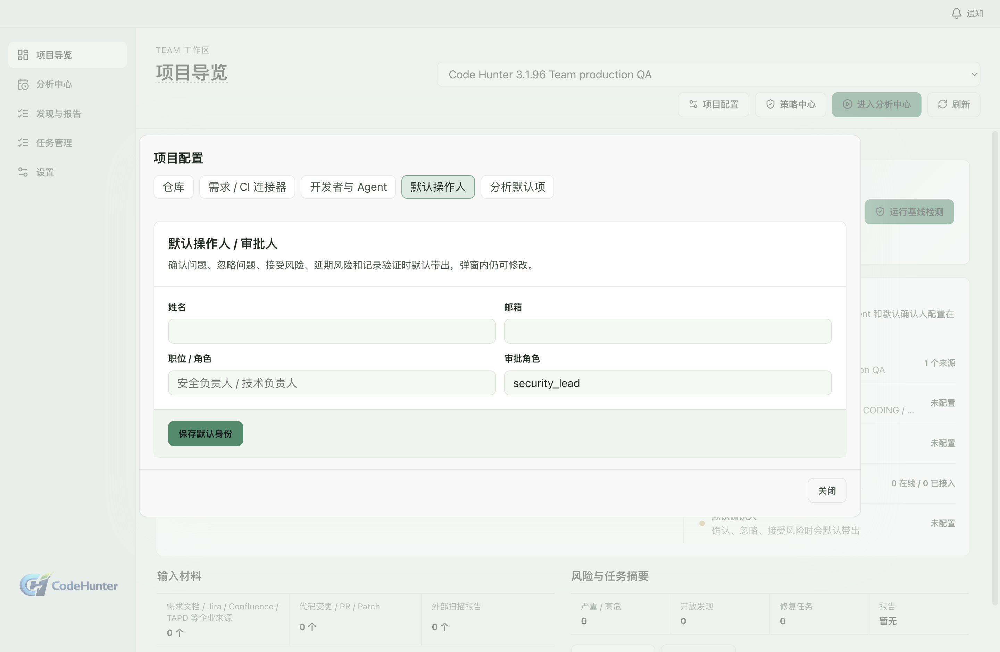

1. Enter the person's name and email.
2. Enter the job title or role and the approval role used by the Team workflow.
3. Choose **Save default identity**.
4. When confirming, ignoring, accepting risk, deferring risk, or recording verification, check the prefilled identity and edit it in the dialog when another authorized person is acting.

**Result:** review dialogs start with a consistent operator identity and still retain an explicit per-action confirmation.

**Common issue:** a default operator shown in the form is not proof that the account can approve the action. Permission comes from Team membership and the project policy.

### Step 4F — Review analysis defaults

Open **Project Configuration → Analysis defaults** before the first run. These are Team workflow defaults shown when an analysis is launched; they are not a replacement for the launch form or global Provider settings.

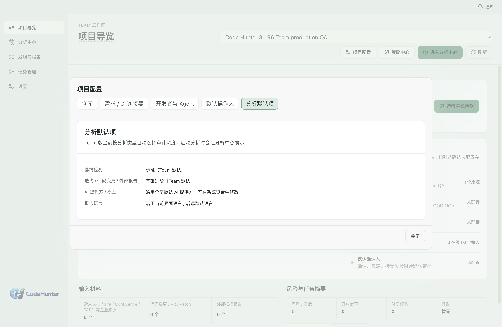

The current defaults are:

| Analysis type | Default shown by the Team project |
| --- | --- |
| Baseline detection | Standard |
| Iteration, code-change, and external-report analysis | Base Advanced |
| AI provider and model | The global default provider and model |
| Report language | The current interface or backend default |

**Result:** each launch starts with predictable values, while the Analysis Center still displays the actual depth and assurance used by that run.

**Common issue:** changing a global provider does not silently change a completed run. Reopen the launch form and check the effective values before starting a new analysis.

### Step 4G — Review Policy Center

Open **Project Overview → Policy Center** before creating release work. Policy Center defines the gates that later Findings, remediation tasks, CI evidence, and Baseline promotion must satisfy.

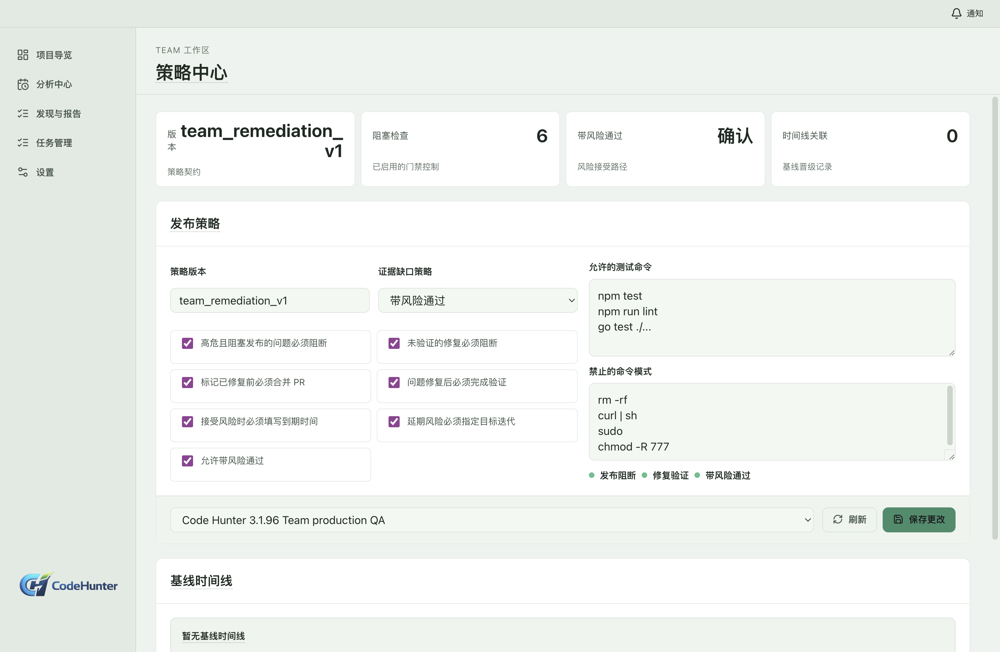

Review the policy version, the number of blocking checks, the **evidence-missing policy**, and whether **Pass with risk** is allowed. The visible controls include high/critical blocking, unverified-fix blocking, requiring a PR before marking a fix, requiring verification after a fix, requiring an expiry for accepted risk, requiring a target Iteration for deferred risk, and allowing Pass with risk.

Also review the allowed test commands and forbidden command patterns. Save only after the security owner agrees with the change, then refresh the page and confirm the persisted policy. These rules constrain later Agent and CLI actions; they do not execute a scan by themselves.

**Result:** the Team has an explicit release policy before analysis or remediation produces a decision.

**Common issue:** a repair can be technically correct and still remain blocked when the policy requires a current PR, verification, owner approval, expiry, or Iteration link.

<a id="team-object-map"></a>
### Understand Team objects before adding integrations

| Object | Purpose |
| --- | --- |
| **Workspace** | Governance boundary for members, roles, and multiple Team Projects |
| **Team Project** | Security-governance unit for one product or code asset |
| **SCM Profile** | Authentication configuration for GitHub, GitLab, or Bitbucket |
| **Code Source** | The actual local or remote repository and its materializable branch, tag, commit, or PR/MR |
| **Connector** | Project-scoped connection to a requirement system, CI service, or notification platform |
| **Developer Agent** | Local worker that claims and executes remediation tasks inside an enrolled repository |
| **MCP** | Local STDIO bridge that lets an authorized editor or assistant read context and submit controlled requests |

An SCM Profile authenticates to a Git service; a Code Source identifies the repository and revision. A Connector imports requirements, gathers CI evidence, or sends notifications; it does not replace a Code Source. A Developer Agent executes bounded remediation work, while MCP exposes approved context and request actions. Their credentials and permissions are separate.

<a id="team-connectors"></a>
## Conditional — Configure Team Connectors

Configure only the connector categories used by the Team Project.

| Category | Supported providers | Used for |
| --- | --- | --- |
| **Requirement** | Jira, Confluence, Meegle, CODING, TAPD, DingTalk | Import requirement material into an Iteration |
| **CI** | GitHub Actions, GitLab CI, Jenkins | Fetch source-bound test and verification evidence |
| **Collaboration** | Slack, Microsoft Teams, Lark | Send governed workflow notifications |

Connectors support Basic, Bearer, or Webhook authentication according to provider. Their visible state is Active, Disabled, or Failed. **Test connection** performs a real remote request; it is not only a local form check.

1. Open the Team Project configuration and expand **Project integrations and CI**.
2. Choose **Add connector**.
3. Select the Team Project and provider kind.
4. Enter the display name, Base URL, and supported authentication mode.
5. Enter the provider-specific default project, space, channel, repository, workflow, or job.
6. Save the connector.
7. Choose **Test connection**.
8. Confirm that the latest test succeeds and the connector is Active.

Never place a Connector token or Webhook URL in documentation, screenshots, logs, or source control.

<a id="baseline-and-iteration"></a>
## Step 5 — Initialize the baseline

A **Baseline** is the accepted code revision together with its security analysis and governance state. Later Iterations compare delivery work against this starting point.

Example: product release 1.8 is accepted on `main` at commit `abc123`. Team initializes `main@abc123` as the Baseline. A later review asks what changed relative to that accepted revision instead of treating the repository as an unknown project.

1. Open **Baseline** for the Team project.
2. Select the tested Code Source.
3. Select the intended branch, tag, or commit.
4. Start baseline initialization.
5. Wait for materialization and analysis to finish.
6. Review baseline status, source revision, reports, findings, contracts, diff, and timeline.
7. Correct the source reference before continuing if the baseline points to the wrong revision.


**Result:** the project has a Baseline tied to a resolvable source revision.

**If it fails:** retest the Code Source and verify the exact branch or commit. The repository URL belongs in Code Source; the Baseline revision must resolve to a real branch, tag, or commit.

## Step 6 — Create an iteration and bind requirements and changes

An **Iteration** is one delivery unit created from a Baseline. It binds Requirement Sources, a Change Set, Findings, remediation tasks, verification evidence, and the release decision.

Example: `REQ-204` adds refund approval. The developer submits PR `#52` at commit `def456`. Create an Iteration from Baseline `abc123`, then bind the requirement, PR, and `abc123..def456` change before analysis.

1. Open **Iterations** and choose **New iteration**.
2. Select the Team project and baseline.
3. Add requirement material when available.
4. Bind the code change using a branch, commit, patch, PR/MR, or local Git diff.
5. Confirm the before-and-after revisions.
6. Save the iteration.
7. Review the iteration timeline and diff.
8. Correct the change binding before analysis if unrelated files or the wrong revision appear.

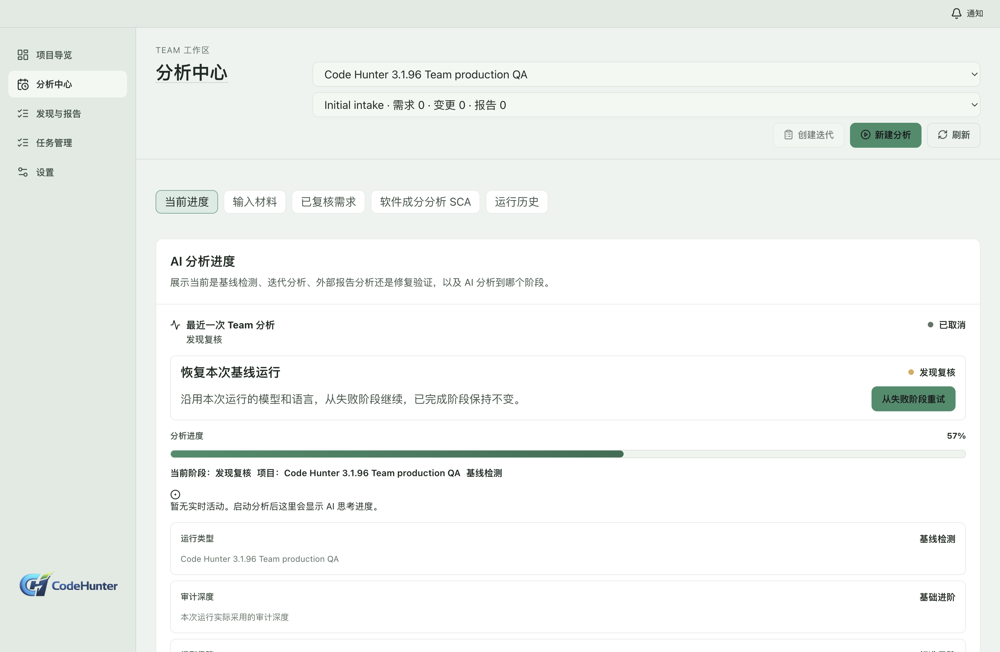

If no ready Baseline exists, **Create iteration** remains disabled and the page explains that a ready Baseline must be created or selected first. Complete Baseline detection, wait for materialization, and return to Analysis Center before trying again. This gate prevents an Iteration from being attached to an unresolved starting revision.

**Result:** the iteration contains the requirement and source change that the team intends to release.

A **Change Set** is the specific source delta inside the Iteration. Creating an Iteration does not replace or promote the Baseline. After an accepted release, **Fresh Baseline Promotion** is the separate action that makes the released revision the next comparison point.

<a id="requirements"></a>
## Step 7 — Import, extract, and review requirements

A **Requirement Source** is the raw input captured for an Iteration. It can be manual text, Markdown, TXT, JSON, CSV, or content imported through a configured requirement Connector. **Requirement Extraction** turns those raw sources into structured, traceable records for human review.

### Import Requirement Sources

1. Open the Iteration and select **Requirements**.
2. Add a manual source or choose an enabled Connector.
3. For Jira, enter the intended JQL query.
4. For Confluence, enter the page IDs and choose whether direct children are included.
5. For Meegle, CODING, TAPD, or DingTalk, enter the provider-specific project and object filters.
6. Preview the source count and query scope.
7. Import the material.
8. Open the raw preview and confirm that the intended objects were captured.

Imported sources keep their source type, external references, raw content path, and content hash in the Iteration workspace.

### Run Requirement Extraction and human review

1. Start **Requirement extraction**.
2. Review the structured records.
3. Check Requirement ID, type, title, summary, Owner, priority, and Acceptance Criteria.
4. Review authentication, authorization, external input, sensitive data, state change, token or secret, and notification security flags.
5. Check Confidence and the quoted source evidence.
6. Resolve duplicate, ambiguous, or uncertain items.
7. Edit, approve, reject, mark as not a requirement, merge, or split each record.
8. Save the reviewed requirement set before running impact analysis.

| Review state | Meaning |
| --- | --- |
| **Pending review** | Extracted but not yet decided by a person |
| **Approved** | Accepted as a requirement for this Iteration |
| **Needs edit** | Requires correction before approval |
| **Rejected** | Not accepted for this Iteration |
| **Not a requirement** | The imported item is not a product requirement |
| **Merged** | Combined into another requirement |
| **Split** | Divided into separate requirements |

Requirement Extraction must preserve ambiguity and uncertainty when the source does not support a definite fact. Human review, not model inference alone, advances the requirement set.

<a id="analysis-and-findings"></a>
## Step 8 — Run requirement, impact, risk, and Finding analysis

The following stages turn reviewed requirements and the Change Set into security context and reviewable Findings:

### Step 8A — Select the Analysis Center context

Open **Analysis Center** after the project and policy configuration is complete. Select both the Team Project and the Iteration shown in the context selectors. The page then exposes the current progress, input material, reviewed requirements, SCA, and run history for that context.

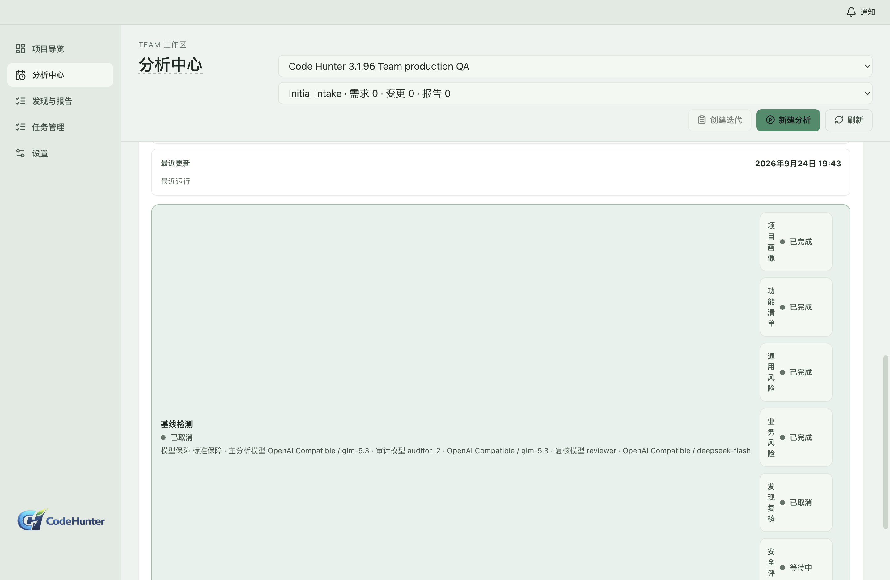

The **Current progress** view tells you which run is active or most recent, its percentage, current stage, effective Audit depth, Model assurance, auditor/reviewer models, and the stages that have completed or are waiting. A cancelled or failed run can be resumed or retried from the displayed recovery point; it is not evidence that the final report is complete.

### Step 8B — Choose the analysis type

Choose **New analysis**. Select the card that matches the input you have; do not use Baseline detection for a change-only review.

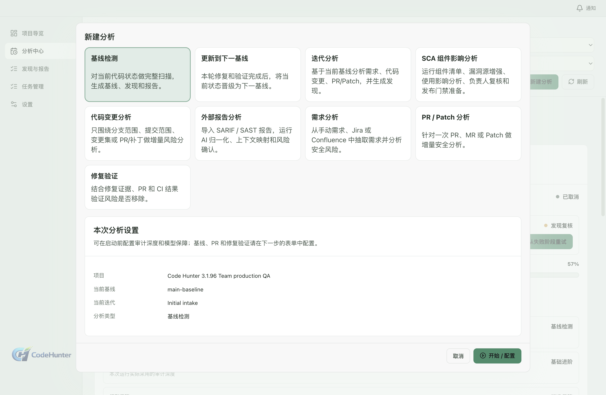

| Analysis type | Use it for |
| --- | --- |
| **Baseline detection** | Scan the current code state and create the initial Baseline, Findings, and report. |
| **Update to next Baseline** | Promote the repaired and verified current state after the release decision. |
| **Iteration analysis** | Analyze Iteration requirements, code changes, PRs, and patches from the current Baseline. |
| **SCA component impact analysis** | Build component inventory, enrich advisories, analyze usage impact, review Owners, and prepare the release gate. |
| **Code-change analysis** | Analyze only a selected branch range, commit range, Change Set, or PR/Patch. |
| **External-report analysis** | Import SARIF/SAST results and normalize them against the Team Project context. |
| **Requirement analysis** | Extract and analyze requirements from manual sources or configured connectors. |
| **PR / Patch analysis** | Review one PR, MR, or patch as an incremental security change. |
| **Fix verification** | Check a repair, its acceptance criteria, PR, and CI evidence against the current Finding. |

Choose **Start / Configure** to open the next form. Before starting, verify the project, current Baseline, Iteration, Audit depth, Model assurance, Provider, and language. Starting a run is a state-changing action; the screenshot shows the choice screen and does not claim that a run was started.

### Step 8C — Read the Analysis Center tabs

The tabs are views into the same selected project and Iteration; they do not create separate projects.

#### Inputs

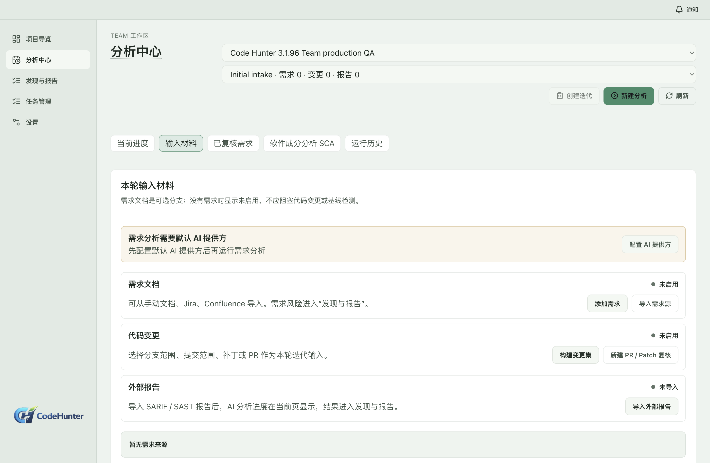

Use **Inputs** to check whether the Iteration has requirement documents, code changes, and external reports. Requirement documents are optional for a code-only baseline, while a requirement or Iteration analysis needs an active source. The page also exposes the configured default AI Provider when extraction requires one.

#### Reviewed requirements

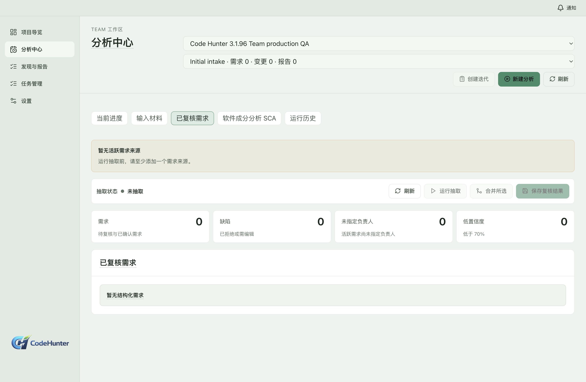

Use **Reviewed requirements** to run extraction, inspect the counts for pending requirements, defects, unassigned Owners, and low-confidence items, then approve, edit, merge, split, reject, or mark an item as not a requirement. An empty state means no active requirement source has been added; it is not a successful extraction.

#### Software Composition Analysis (SCA)

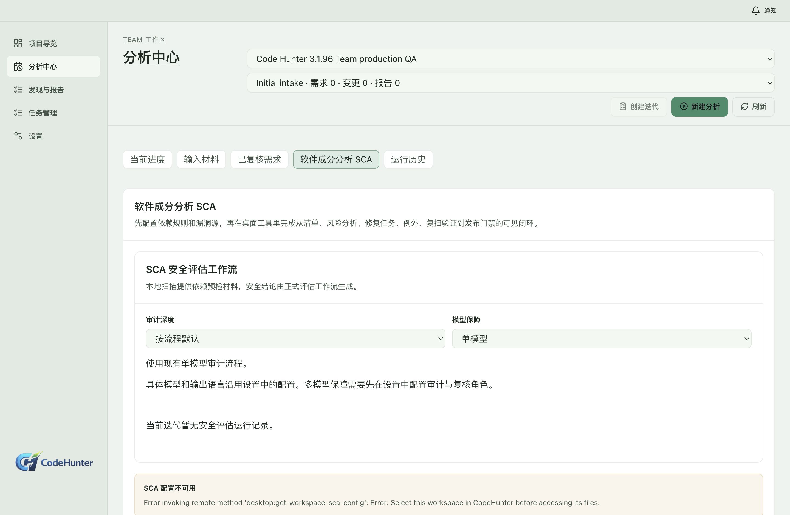

Use **SCA** to configure dependency rules and vulnerability sources, then move from component inventory to impact analysis, remediation, exceptions, rescanning, and release-gate evidence. The analysis depth and Model assurance selectors shown here control the SCA workflow; the page does not replace the Team policy gate. If the workspace is not selected or SCA is not configured, the page reports that state instead of inventing a result.

#### Run history

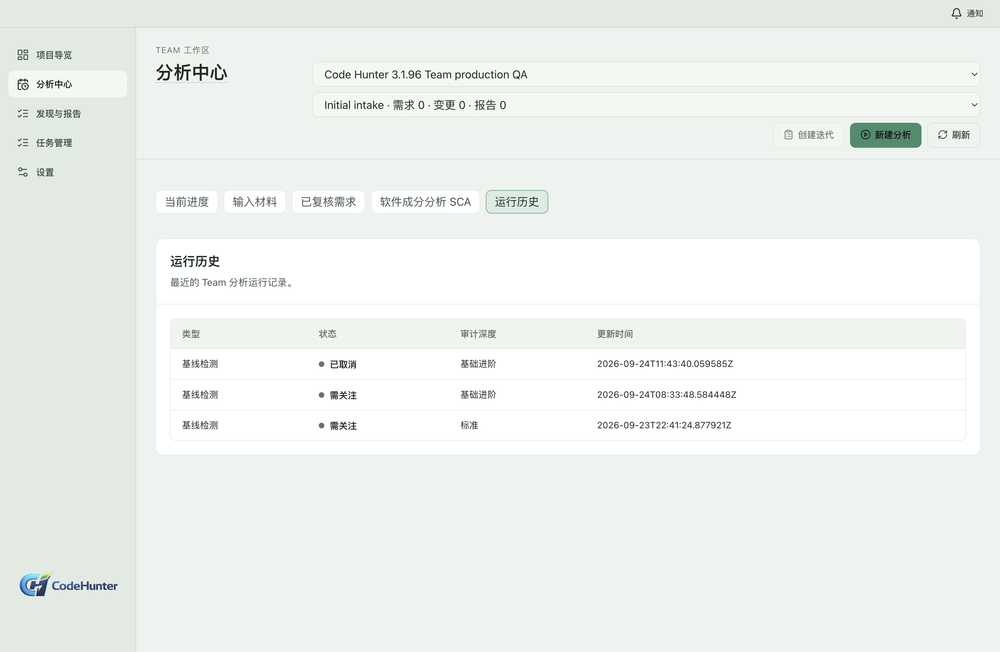

Use **Run history** to compare previous run types, statuses, Audit depth values, and update times. A history row marked cancelled, failed, or needs attention must be resumed or retried before treating the associated report or Finding set as current.

Run the stages in this order:

1. **Requirement Impact** maps requirements to affected features, modules, data, permissions, controls, and responsible Owners.
2. **Security Analysis** identifies security expectations and risks in the requirements.
3. **Control Owner Review** lets the responsible person confirm the expected control and decision.
4. **Gate Policy** turns reviewed requirements, approvals, Findings, and evidence into release conditions.
5. **Change Impact** identifies what the code change touches.
6. **Delta Generic Risk** finds general security risk introduced or changed by the Iteration.
7. **Delta Business Risk** evaluates money, state, approval, tenant, identity, and other business-sensitive flows.
8. **Delta Finding Review** turns the delta analysis into Findings ready for human review.
9. Open the Findings workbench and inspect source, affected area, evidence, product impact, and current state.
10. Accept, reject, downgrade, defer, or request more evidence.
11. Assign an Owner to every accepted Finding that requires work.

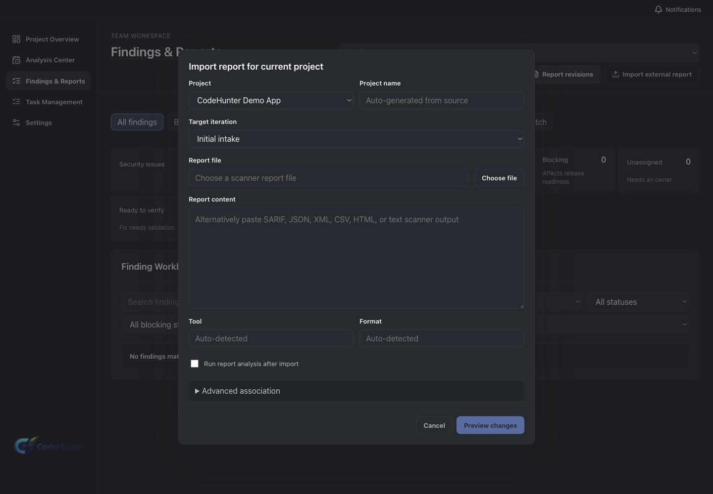

**Result:** the Iteration has Findings tied to Requirement Sources, code change, evidence, product impact, and an accountable Owner.

### Optional at this stage — Import external SAST or SARIF

1. Open external report intake.
2. Select the report file.
3. Preview the detected format and finding count.
4. Bind the report to the Team project, branch, commit, scanner, and report date.
5. Import the report.
6. Run external report analysis.
7. Review normalized Findings.
8. Let the responsible Owner decide which items enter the governed Finding lifecycle.

**If the report is empty:** check its format, project binding, commit, scanner metadata, and report date before importing again.

A **Normalized Finding** is an external result converted into Team's common lifecycle so it can be assigned, remediated, verified, and governed like a native Finding.

<a id="sca-and-release-gate"></a>
## Step 9 — Run SCA and resolve dependency policy

SCA is a Team capability. Run it before release readiness whenever the workspace policy includes dependency or license gates.

| Term | Meaning |
| --- | --- |
| **SAST / SARIF** | External scanner results about source-code issues |
| **SCA** | Analysis of dependency components, vulnerabilities, licenses, fixed versions, and lifecycle state |
| **Advisory** | A published security notice that affects a component version |
| **Exploitability / Reachability** | Whether the vulnerable behavior can be reached or used in the current product |
| **VEX** | A structured statement about whether a component vulnerability affects this product |
| **Exception** | A temporary policy exception with Owner, reason, scope, approval, and expiry |
| **Release Gate** | The decision produced from Findings, SCA, verification, approvals, and evidence |

1. Open the iteration SCA panel.
2. Select the dependency source or lockfile context.
3. Configure severity, exploitability, license, lifecycle, and blocking rules.
4. Run the dependency scan.
5. Review components, advisories, licenses, fixed versions, reachability or exploitability information, and lifecycle state.
6. Run SCA analysis.
7. Assign an Owner to blocking items.
8. Upgrade or replace the dependency when a fix is available.
9. When policy permits, create a scoped VEX record or time-limited exception with owner, reason, approval, and expiry.
10. Verify the dependency change or approved exception before evaluating the release gate.

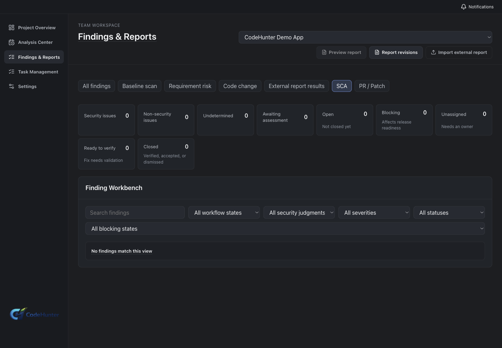

**Result:** every dependency gate condition has a fix, a verified state, or an active governed exception.

**If it remains blocked:** check for an expired exception, missing Owner, missing approval, unverified fixed version, prohibited license, or unresolved exploitability condition.

A VEX record or Exception does not delete the Finding. An expired or incomplete Exception can block the Gate again. After upgrading or replacing a dependency, run a new scan; an older SCA snapshot does not prove the new source is clean.

<a id="remediation-and-verification"></a>
## Step 10 — Create and assign remediation work

This stage converts an accepted Finding into governed work that a developer can claim and a reviewer can verify.

| Term | Meaning |
| --- | --- |
| **Remediation Task** | Governed repair work created from a confirmed Finding |
| **Acceptance Criteria** | The control that must be restored and the test result required for closure |
| **Remediation Context Pack** | Finding, evidence, source scope, assumptions, and Acceptance Criteria supplied to the developer |
| **Local Fix Package** | Bounded repair material; generation does not apply or verify the patch |
| **CI Evidence** | Test or pipeline evidence tied to the exact repository, commit SHA, and current attempt |
| **Fix Verification** | Independent check of the submitted code, criteria, and current evidence |
| **Stale Evidence** | Evidence from an older commit, patch, or verification attempt |

1. Open the accepted finding.
2. Choose **New remediation task**.
3. Assign the Owner.
4. Write acceptance criteria that name the expected control and test result.
5. Link the iteration, finding, affected source revision, and due date.
6. Save the task.
7. Let the assigned developer claim it.
8. Generate the remediation context pack when the developer needs evidence, affected code, assumptions, and acceptance criteria together.
9. Choose the execution surface:
   - Team desktop local fix package.
   - Team Developer Agent CLI.
   - VS Code Remediation Inbox.
   - JetBrains Remediation Inbox.
   - An existing PR/MR supplied by the developer.


**Result:** the task has an owner, acceptance criteria, source context, and a selected delivery path.

<a id="developer-tools"></a>
## Step 11 — Optional Developer Agent, CLI, IDE, and project sub-agents

Developer tools are optional execution surfaces inside the remediation stage. The Team desktop remains authoritative for workspace roles, risk acceptance, fix verification, release readiness, and baseline promotion.

### What the Developer Agent is

**Agent Management** can enroll multiple local Developer Agents for different developers and repositories. Each enrolled agent is a scoped worker for assigned Team remediation tasks. Some teams call these project child agents or sub-agents; the product UI calls them **Developer agents**.

A Developer Agent can receive tasks, claim work, obtain fix context, preview or apply a bounded patch, run approved tests, and synchronize a PR. It does not inherit workspace administrator rights and cannot accept risk, approve release, or promote a baseline.

### Components

| Component | Purpose |
| --- | --- |
| `code-hunter-team-agent` | Local CLI for enrollment, task sync, patch, tests, and PR handoff |
| `code-hunter-team-agent-lsp` | Language-service bridge used by IDE integrations |
| VS Code extension | CodeHunter activity view and Remediation Inbox |
| JetBrains plugin | CodeHunter Remediation Inbox tool window |
| `.codehunter/team-agent.toml` | Repository-scoped enrollment and endpoint configuration |

The IDE packages include the Team Agent and Team Agent LSP for supported platforms. The current verified packages are stored in this repository:

- [Download the VS Code extension (VSIX)](../developer-tools/code-hunter-team/3.1.94/plugins/vscode/codehunter-team-vscode-3.1.94.vsix)
- [Download the JetBrains plugin (ZIP)](../developer-tools/code-hunter-team/3.1.94/plugins/jetbrains/codehunter-team-jetbrains-3.1.94.zip)
- [Read package checksums, supported platforms, and installation notes](../developer-tools/code-hunter-team/3.1.94/README.md)

### Enroll a repository

1. In Team desktop open **Agent Management** for the intended project.
2. Create a one-time enrollment code for the developer.
3. Keep the code private; it is shown for enrollment, not for documentation or source control.
4. In the repository run the enrollment command supplied by Team. The CLI form is:

```bash
code-hunter-team-agent enroll \
  --code <one-time-code> \
  --developer-email <developer@example.com> \
  --repo .
```

5. Confirm that `.codehunter/team-agent.toml` was created.
6. Do not commit that file or its token.
7. Run the local health check:

```bash
code-hunter-team-agent doctor --repo .
```

8. Return to Agent Management and confirm that the agent is online and bound to the intended repository.

### CLI task flow

Run these commands from the bound repository. Replace placeholders with IDs and files shown by the Team task.

```bash
# Show assigned work
code-hunter-team-agent tasks

# Claim one remediation task
code-hunter-team-agent claim <task-id>

# Generate bounded repair material
code-hunter-team-agent generate-fix <task-id> \
  --mode patch \
  --output-dir .codehunter/fixes

# Inspect the patch against the enrolled repository boundary
code-hunter-team-agent preview \
  --patch-file <fix.patch> \
  --repo .

# Check application without changing the worktree
code-hunter-team-agent apply \
  --patch-file <fix.patch> \
  --repo . \
  --dry-run

# Apply only after reviewing the preview and current Git state
code-hunter-team-agent apply \
  --patch-file <fix.patch> \
  --repo .

# Run a command allowed by local and Team release policy
code-hunter-team-agent test \
  --task-id <task-id> \
  --program npm -- test

# Synchronize an existing PR URL, or let policy allow creation
code-hunter-team-agent create-pr \
  --task-id <task-id> \
  --branch <fix-branch> \
  --base main \
  --draft

# Refresh heartbeat, tasks, and server state
code-hunter-team-agent sync
```

Other operational commands include `heartbeat`, `bind-repo`, and JSON output through the global `--json` option. The advanced `run-e2e` command can orchestrate the policy-controlled claim, patch, test, PR, and verification sequence; use its installed `--help` output and the project policy rather than copying options from another build.

The CLI enforces the enrolled repository boundary, patch checks, local command allowlist, and Team release policy. Test or PR operations can be rejected when the configured command, remote, branch, or project policy does not allow them.

### VS Code flow

1. Download and install the [Team VS Code extension](../developer-tools/code-hunter-team/3.1.94/plugins/vscode/codehunter-team-vscode-3.1.94.vsix).
2. Open the CodeHunter activity bar.
3. Open **CodeHunter Remediation Inbox**.
4. Use **CodeHunter: Configure Agent** when the config or binary path is not detected automatically.
5. Choose **Refresh Tasks**.
6. Open and verify the task, project, and source commit.
7. Use **Claim Task → Generate Fix → Preview Patch → Apply Patch → Run Tests → Create PR**.
8. Confirm every action that changes the working tree, runs a command, or creates remote state.

### JetBrains flow

1. Download and install the [Team JetBrains plugin](../developer-tools/code-hunter-team/3.1.94/plugins/jetbrains/codehunter-team-jetbrains-3.1.94.zip).
2. Restart the IDE when requested.
3. Open **View → Tool Windows → CodeHunter Remediation Inbox**.
4. Configure the Agent config, Agent binary, LSP binary, API override, and default test command only when automatic discovery is not sufficient.
5. Refresh tasks, claim the intended task, generate and preview the patch, apply after review, run tests, and create or link the PR/MR.

No IDE screenshot is shown here because a native VS Code or JetBrains capture was not completed in the isolated documentation environment. Electron desktop screenshots are not presented as IDE evidence.

### Credential and confirmation boundaries

- The enrollment code is short-lived and must not be committed or placed in screenshots.
- `.codehunter/team-agent.toml` contains repository-scoped agent configuration and must stay out of source control.
- The Agent token is separate from the Team desktop license and provider API credential.
- Patch application, tests, commits, and PR creation require developer review and can require confirmation.
- The Team desktop and server remain authoritative for owner approval, accepted risk, fix verification, release readiness, and baseline promotion.

## Step 12 — Apply the fix, run tests, and bind CI evidence

1. Review the current source worktree and exact target commit.
2. Preview the patch, test command, rollback path, and assumptions.
3. Apply the patch locally or submit the PR/MR.
4. Run the project’s real tests.
5. Run CI on the submitted commit.
6. Bind the CI evidence to the remediation task and exact commit SHA.
7. Attach or synchronize the PR/MR.
8. Confirm that the task, patch, tests, CI, and source revision all refer to the same attempt.

**Result:** the remediation task has source-bound test and CI evidence rather than a detached success message.

**If evidence is rejected:** bind it to the exact submitted commit and rerun the current verification attempt. Evidence from an older patch or another revision is stale.

## Step 13 — Run formal fix verification

1. Open the remediation task.
2. Confirm the acceptance criteria.
3. Review the submitted diff and CI evidence.
4. Run **Fix verification**.
5. Review the final state:
   - **Verified fixed** — current evidence proves the control is restored.
   - **Accepted risk** — an authorized owner approved a scoped, recorded exception.
   - **Pending verification** — the fix or evidence is incomplete.
6. Reopen the task when the current code or evidence no longer supports the prior result.

**Result:** closure is tied to the current source attempt, reviewer decision, and evidence.

<a id="release-readiness"></a>
## Step 14 — Decide release readiness and promote a fresh baseline

1. Open **Release Readiness**.
2. Review the current state:
   - **Blocked** — a required finding, dependency, approval, or evidence item remains unresolved.
   - **Pending verification** — a submitted fix has not completed formal verification.
   - **Pass with risk** — remaining risk has a valid owner, scope, approval, and expiry.
   - **Ready** — required gates are satisfied.
3. Resolve missing finding decisions, SCA conditions, owner approvals, fix verification, and CI evidence.
4. Record the release decision.
5. After the accepted release is materialized, promote a fresh baseline from the released revision.
6. Confirm that the new baseline points to the released branch and commit.

**Result:** the release decision is reviewable, and the next iteration starts from the accepted source state.

<a id="team-mcp"></a>
## Optional — Connect Team MCP

Team MCP is a local STDIO bridge exposed by the running Team desktop. Use it only after workspace, member, project, and permission boundaries exist.

Example: a Jira Connector imports `REQ-204` into an Iteration. A Developer Agent claims its remediation task in an enrolled repository. Team MCP lets an authorized external assistant read that task context and submit a verification request that still waits for desktop review.

1. Keep the matching Team desktop instance running.
2. Open **Settings → External Apps / MCP**.
3. Enable external application connections.
4. Create a connection name.
5. Choose **Read only** or **Developer collaboration**.
6. Select the Team projects.
7. Select the acting Team member for each project.
8. Choose whether findings, reports, evidence, tasks, and repair material may be returned.
9. Create the connection and copy the Codex or general MCP configuration.
10. From the client, read only the authorized project and member context.
11. Submit analysis, report, repair, or verification requests when permitted.
12. Review the request preview in Team desktop.
13. Confirm or cancel the request.
14. Check the idempotency key and request history. The idempotency key prevents the same external work request from being executed twice.
15. Revoke and recreate the connection when its scope changes.


**Boundary:** Team MCP does not automatically import arbitrary projects, execute arbitrary commands, accept risk, approve a release, or promote a Baseline. A Team connection cannot be used with Personal desktop. Connector credentials, Developer Agent tokens, model Provider credentials, and MCP connection secrets are separate.

<a id="troubleshooting"></a>
## Troubleshooting by stage

| Problem | Check |
| --- | --- |
| Workspace is missing | Confirm account membership, role, Team license state, and workspace refresh |
| SCM connects but refs are empty | Check repository permissions and the configured default branch |
| Baseline cannot materialize | Use a resolvable branch, tag, or commit; do not use the repository URL as the revision |
| External report is empty | Check format, project, branch, commit, scanner, and report date |
| Finding has no Owner | Activate the member and assign an allowed project/remediation role |
| SCA blocks release | Resolve the component or supply an active owner-approved exception and verification |
| Agent inbox is empty | Check enrollment, repository binding, task assignment, agent heartbeat, and matching Team instance |
| CLI test is rejected | Use a command allowed by both the local allowlist and Team release policy |
| CI evidence does not match | Bind evidence to the exact submitted commit and current attempt |
| Release remains pending | Complete fix verification, owner approval, SCA, and required evidence |
| Baseline points to the wrong branch | Correct the source revision before promotion and verify the released commit |
| Team MCP cannot connect | Keep Team running and recreate the member/project-scoped STDIO configuration |

## Team closure checklist

- Team is activated and the intended workspace is open.
- Members and project roles are assigned.
- The provider test succeeds.
- The Team project has a tested Code Source and correct default branch.
- The baseline points to a resolvable accepted revision.
- The iteration contains the intended requirement and code change.
- Required analysis, external report, and SCA stages completed according to policy.
- Every accepted finding has an Owner and a remediation decision.
- Every submitted fix is tied to the current source revision, tests, CI evidence, and verification attempt.
- Developer Agent or IDE actions stayed inside the enrolled repository and approval policy.
- Release Readiness has a recorded result.
- The accepted release was promoted to a fresh baseline.
- Any Team MCP connection is scoped to named projects and members and can be revoked.
