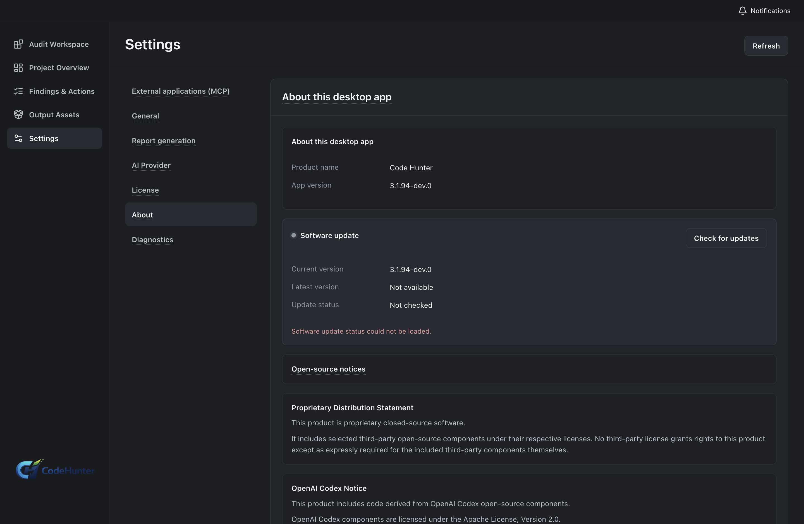
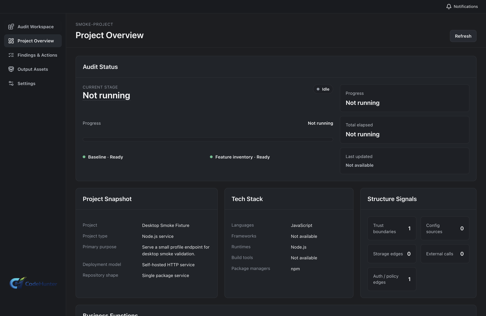
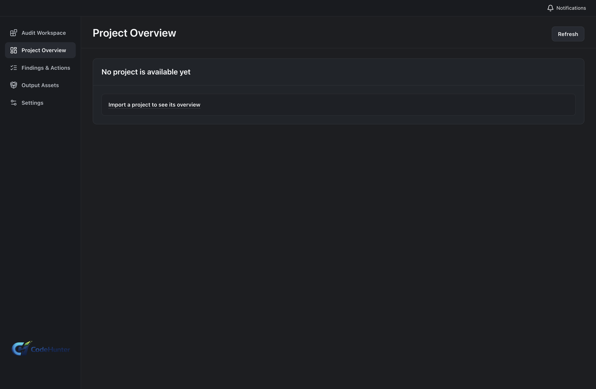
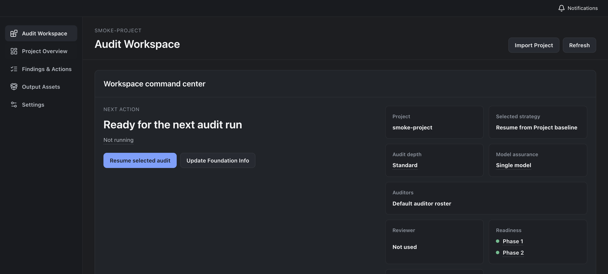
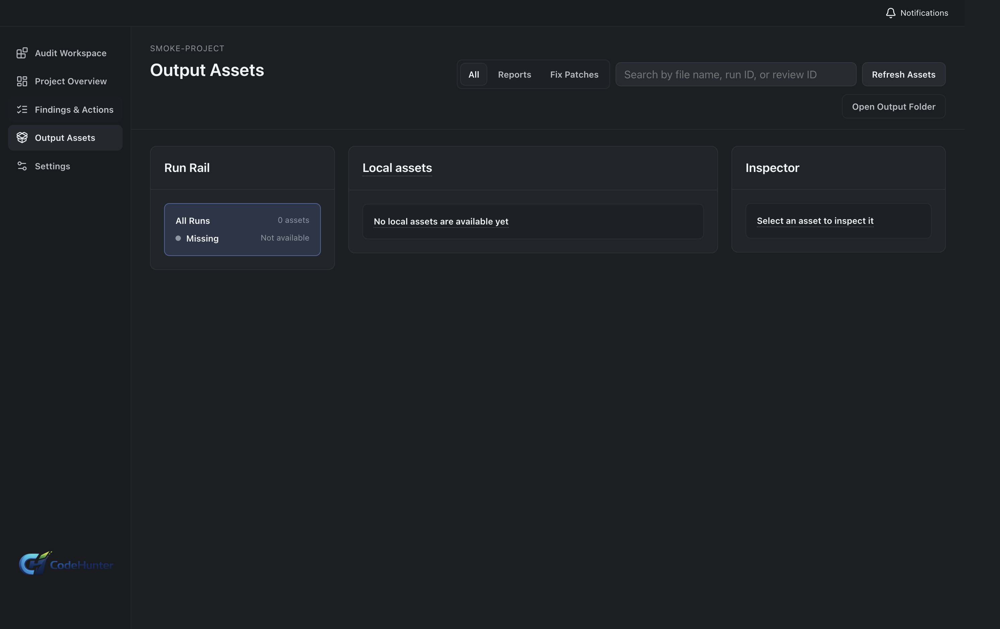
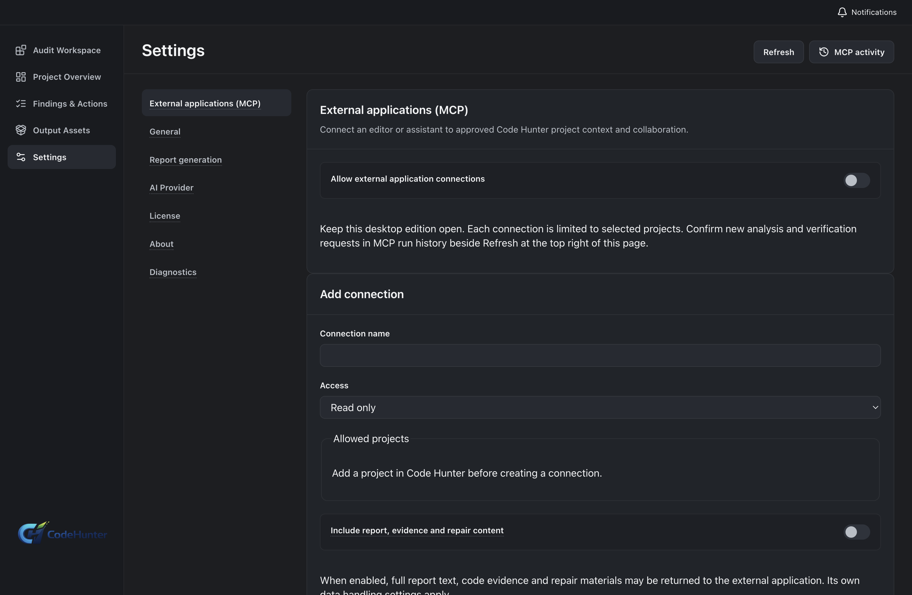

# Code Hunter Personal 3.1.94: screenshot-backed tutorial

This is the English, user-facing workflow for **Code Hunter Personal 3.1.94**. The screenshots were captured from the isolated `3.1.94-dev.0` renderer build associated with source commit `e4b6868`; each image is listed in [`docs/assets/manifest-3.1.94.json`](assets/manifest-3.1.94.json). The development profile proves the UI path and local persistence. It does not prove a production entitlement, a valid license, or a successful official activation.

The project and finding screenshots use the neutral desktop smoke fixture. The report and fix screens intentionally show the current output entry route when no report or patch is present; use the documented prerequisites and **Success state** to verify the corresponding generated asset in an authorized project.

## Before you start

Prepare a local project that you are authorized to review, a separate working copy for generated fixes, and the provider details that your organization permits you to use. Keep production credentials out of screenshots. Use the official Personal installer for production; use a dev build only for the isolated evidence path described in the manifest.

Each step below has the same contract: **Goal**, **Path**, **Enter or choose**, **Success state**, **Screenshot**, **Why it matters**, **If it fails**, and **Next**.

## 1. Download and identify Personal

**Goal.** Confirm that the installed application is Personal 3.1.94 before entering credentials.

**Path.** Launch Code Hunter and open **Settings → About** (or the edition badge in the start screen).

**Enter or choose.** Confirm `Personal`, `3.1.94`, and the expected channel. The screenshot build may display `3.1.94-dev.0`.

**Success state.** The edition is Personal and the version is visible in the same application instance that will own the project catalog.

**Screenshot.**

**Why it matters.** Personal and Team have different entitlements, catalogs, MCP bridges, and workflow routes.

**If it fails.** Quit the app, check the installer name and About page, and do not continue with a mixed Personal/Team user-data directory.

**Next.** Open **Settings → License**.

## 2. Authenticate and activate

**Goal.** Complete the official server-backed Personal activation path.

**Path.** **Settings → License → Sign in / Activate**, then follow the official account or license flow shown by the installed release.

**Enter or choose.** Use the purchase email, license details, or activation method supplied for the Personal edition. Never paste a license key into a public issue, screenshot, MCP configuration, or provider form.

**Success state.** The desktop shows the Personal entitlement, device status, validity period, and a successful server-backed validation timestamp. A local cache alone is not success evidence.

**Screenshot.**

**Why it matters.** Activation controls access to the official product. Provider configuration and MCP access are separate concerns.

**If it fails.** Record the visible error, check the account and edition, verify network access to the official service, and contact support. Do not bypass the flow by editing local license files. In the dev capture, this step is marked `not_executed` when no test entitlement is available.

**Next.** After validation, open **Settings → Providers**. In the dev build, continue with the same UI path while keeping the entitlement boundary explicit.

## 3. Configure and validate a provider

**Goal.** Save a provider that the audit runtime can actually call.

**Path.** **Settings → Providers → Add provider**.

**Enter or choose.** Select a preset, enter the provider **base URL**, **model**, and the secret in the protected API key field. Save it, select **Test provider**, then mark it as the default provider only after the test returns successfully.

**Success state.** The provider card reloads after navigation, shows the selected model and base URL, reports a successful test, and remains the default after restart. The key is never rendered as plain text.

**Screenshot.**

**Why it matters.** A saved form is not proof that the runtime can authenticate. A provider test closes the configuration-to-runtime gap.

**If it fails.** Check URL format, model availability, network policy, and the provider error. Re-enter the secret through the protected field. Do not include the secret in logs or screenshots.

**Next.** Open the project importer from the start screen or **Projects → Import project**.

## 4. Import a local project and verify the scope

**Goal.** Register the intended source root and workspace in the Personal catalog.

**Path.** **Projects → Import project → Choose folder**.

**Enter or choose.** Choose the repository root, set a neutral display name if needed, and confirm the source path and workspace path. The native folder picker is a system-level action; if it is not executed in the current environment, use the renderer capture as UI evidence and record the native boundary in the manifest.

**Success state.** The project overview shows `CodeHunter Demo App` (or your approved name), the correct source root, and a persisted project record after reopening the app.

**Screenshot.**

**Why it matters.** Every later finding and fix must be traceable to the same source root and workspace.

**If it fails.** Stop when the path is wrong. Re-import the correct repository, remove generated build output from the source selection, and verify the project record after restart.

**Next.** Open **Project scope** and configure exclusions.

## 5. Set exclusions and audit scope

**Goal.** Keep caches, build products, dependencies, and unrelated generated files out of the audit.

**Path.** **Project → Scope / Exclusions**.

**Enter or choose.** Add only approved exclusions such as `node_modules`, build output, caches, generated coverage, vendored artifacts, and unrelated fixtures. Keep security-relevant configuration and deployment files in scope.

**Success state.** The scope preview lists the intended source files and the exclusion summary is saved to the project.

**Screenshot.**

**Why it matters.** Over-broad scope produces noise and can expose data that should never leave the workstation.

**If it fails.** Review the path patterns, refresh the preview, and compare the file count with the repository. Do not compensate for a wrong scope by accepting generic findings.

**Next.** Open **Features / Audit configuration**.

## 6. Choose language, depth, and model assurance

**Goal.** Make the audit settings explicit and repeatable.

**Path.** **Features → Security audit → Configure**.

**Enter or choose.** Select output language, audit depth (`Standard` for a first pass or the deeper option when time and provider budget permit), model assurance, and a fresh run. Save the selection before launching.

**Success state.** The selected language, audit depth, and assurance strategy remain selected after navigating away and back.

**Screenshot.**

**Why it matters.** Depth changes coverage, runtime, and evidence expectations. It must be visible in the resulting review record.

**If it fails.** Confirm a provider is set as default, check the disabled reason shown beside the option, and resolve that prerequisite before launching.

**Next.** Start the project profile and function inventory.

## 7. Build the project context

**Goal.** Create an evidence-backed map before risk analysis.

**Path.** **Features → Project profile → Start**, then **Function inventory → Start**.

**Enter or choose.** Use the saved project scope and the selected provider. Review framework, entry points, permissions, trust boundaries, external calls, authentication, uploads, admin functions, tenant boundaries, and sensitive data flows.

**Success state.** The project overview and function inventory show product behavior and affected areas, not only a file list.

**Screenshot.**

**Why it matters.** Context is the source for meaningful findings and reduces rule-name-only output.

**If it fails.** Fix the scope or provider first. If the output is generic, do not proceed to report export; rerun context with a narrower source and a working provider.

**Next.** Start generic risk, business risk, and finding review.

## 8. Run the audit and review findings

**Goal.** Produce findings that a human can confirm or reject.

**Path.** **Features → Start audit**, then **Findings & Actions**.

**Enter or choose.** Run generic risk analysis, business risk analysis, and finding review. Wait for the run to reach a terminal state before judging results.

**Success state.** Findings show severity, confidence, affected behavior, source location, evidence, and a remediation direction.

**Screenshot.**

**Why it matters.** The finding workbench is the transition from automated discovery to a user-owned security decision.

**If it fails.** Inspect the run status and provider error, refresh the project, and verify that the same run and project are selected. Avoid starting duplicate runs while a live run is active.

**Next.** Open a finding and the evidence view.

## 9. Confirm, reject, defer, or downgrade a finding

**Goal.** Record a human decision with the evidence that supports it.

**Path.** **Findings & Actions → Open finding → Review decision**.

**Enter or choose.** Choose **Accept**, **Reject**, **Downgrade**, or **Defer**. Add a short rationale and keep the source location and affected behavior visible.

**Success state.** The decision persists after refresh and the finding summary reflects the new state.

**Screenshot.**

**Why it matters.** Reports and fixes must represent reviewed findings, not raw model output.

**If it fails.** If the decision is disabled, complete the required evidence or wait for the assessment stage. If evidence is insufficient, defer rather than accepting a guess.

**Next.** Open **Proof / Evidence**.

## 10. Verify the evidence chain

**Goal.** Confirm source, behavior, impact, and remediation direction.

**Path.** **Finding → Proof / Evidence**.

**Enter or choose.** Check the source excerpt, function chain, affected behavior, missing control, product impact, severity, confidence, and suggested remediation. Follow linked source files only inside the authorized project.

**Success state.** The evidence view explains why the finding is reachable or defensible and what change would address it.

**Screenshot.**

**Why it matters.** Evidence is the contract between the finding, the report, and the fix package.

**If it fails.** Mark the item as needs evidence or reject it; do not export a claim that cannot be reconstructed from the project.

**Next.** Select reviewed findings and open report preview.

## 11. Export a reviewed report

**Goal.** Create a report that contains only findings with a human decision.

**Path.** **Findings & Actions → Reports → New report**.

**Enter or choose.** Select confirmed findings, choose the report language and format, preview the cover, summary, evidence, and remediation sections, then save the report.

**Success state.** The preview contains the selected findings and can be reopened from the project asset list.

**Screenshot.**

**Why it matters.** A saved report is a durable evidence artifact, not just a browser-like view of current findings.

**If it fails.** Check that the findings are reviewed and the report asset directory is writable. If a rejected finding appears, return to selection and regenerate.

**Next.** Return to Findings & Actions and create a scoped fix package.

## 12. Generate, preview, and apply a scoped fix package

**Goal.** Change only the files required by accepted findings and preserve rollback information.

**Path.** **Findings & Actions → Select accepted finding(s) → Generate fix package**.

**Enter or choose.** Review patch scope, assumptions, test command, rollback instructions, and the selected finding ids. Confirm the source working tree is clean or save a checkpoint before applying.

**Success state.** The package has a stable id, a readable patch preview, explicit tests, and an explained rollback path.

**Screenshot.**

**Why it matters.** A scoped package makes model-assisted repair reviewable and reversible.

**If it fails.** Narrow the selected findings, regenerate, or reject the package. Do not apply a package that touches unrelated files or has no test and rollback plan.

**Next.** Apply only after the project checkpoint is recorded.

## 13. Apply, test, and roll back safely

**Goal.** Close the repair loop in the source working tree.

**Path.** **Fix package → Apply**, then run the project test command outside or alongside Code Hunter as appropriate.

**Enter or choose.** Confirm the target working tree, apply the package, inspect the diff, run tests, and record the result. To roll back, use the package rollback action or restore the saved checkpoint; do not delete files manually when the package provides a reversible operation.

**Success state.** The diff matches the package preview, tests run against the changed tree, and the project can be returned to its pre-fix state.

**Screenshot.**

**Why it matters.** Generated bytes, source application, test evidence, and rollback are separate claims that must all be checked.

**If it fails.** Stop, capture the failed test and diff, roll back, and regenerate with narrower scope. Never mark a finding fixed from model prose alone.

**Next.** Configure the Personal MCP bridge.

## 14. Configure Personal MCP

**Goal.** Give a local MCP client only the project and materials it is allowed to read or request.

**Path.** **Settings → External Apps / MCP → Add connection**.

**Enter or choose.** Set a connection name, choose the allowed projects, select **Read-only** or **Development collaboration**, choose whether reports/evidence/fix material are included, and copy the Codex or generic MCP configuration. Keep the matching Personal desktop instance running.

**Success state.** The connection shows its scope and permission mode, and the copied configuration points to the local Personal STDIO bridge without embedding a license key or provider secret.

**Screenshot.**

**Why it matters.** MCP is a scoped local connector; it is not a second authentication or entitlement system.

**If it fails.** Check that Personal is running, the client uses the Personal configuration, and the selected project is allowed. Do not reuse a Team connector.

**Next.** Use the MCP tools and inspect the request history.

## 15. Use Personal MCP and revoke it

**Goal.** Read authorized state and submit explicit desktop-confirmed work requests.

**Path.** In the MCP client, call the exposed project, snapshot, finding, report, or fix-material reads; for a change, submit a work request that the desktop user can approve. Return to **Settings → External Apps / MCP** to inspect history or revoke.

**Enter or choose.** Start by listing authorized projects, read a project snapshot, read a finding and report, then inspect the idempotent work-request record. Revoke the connection and reauthorize only when the scope is correct.

**Success state.** Reads are limited to the selected project; development requests appear in desktop history and require the user confirmation required by the permission mode.

**Screenshot.**

**Why it matters.** The desktop remains the authority for project scope, source changes, and fix application.

**If it fails.** Verify the bridge process and client configuration, then compare the connector version with the matrix. A connector cannot list a project that was never authorized.

## Personal troubleshooting map

| Symptom | First check | Safe recovery |
| --- | --- | --- |
| Provider unavailable | Base URL, model, protected key field, provider test | Fix and retest the provider before rerunning the audit |
| Project path is wrong | Project overview source/workspace path | Re-import the intended repository; do not edit catalog files by hand |
| Results are generic | Scope, project profile, function inventory, provider response | Narrow scope and rebuild context |
| Report lacks a finding | Human review state and report selection | Review the finding and regenerate the report |
| Fix package is broad | Selected findings and patch preview | Reject and regenerate with narrower scope |
| MCP mismatch | Personal/Team connector, desktop version, running instance | Use the matching connector and revoke stale authorization |
| Activation cannot be proven | Official server response and account | Keep the visible error; local cache is not entitlement proof |

## Personal completion checklist

- [ ] Edition and version are visible.
- [ ] Official activation result is server-backed, or the dev evidence is explicitly marked as UI-only.
- [ ] Provider save, reload, test, and default selection persist.
- [ ] Project path and exclusions are correct.
- [ ] Audit depth and assurance selection persist.
- [ ] Findings include source and evidence.
- [ ] Human decisions are recorded before report export.
- [ ] Fix package scope, tests, and rollback are reviewed.
- [ ] MCP scope and permission mode are explicit and revocable.
