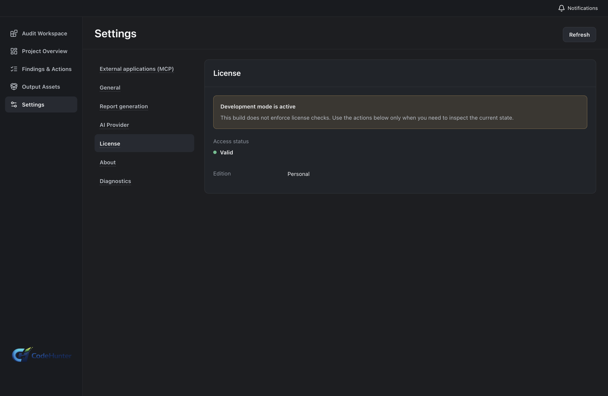

# Personal: Get Started

Personal is for a single user who imports a local project, runs a security audit, reviews findings, and prepares reports or a scoped fix package.

## Download and open Personal

1. Download Personal from the [official Code Hunter download center](https://www.arvantacyber.com/code-hunter/download/).
2. Install and start the Personal desktop app.
3. Open **Settings → About** and confirm that the running app is Personal.

## Activate and validate

1. Open **Settings → License**.
2. Choose the activation action shown by the app.
3. Complete the official service step.
4. Return to the app and select **Validate** or **Refresh**.
5. Use **Deactivate** when moving access to another device.

### Result

The License page shows the current Personal access state. A development activation screen only demonstrates the desktop path; it does not grant a production entitlement.

### Common issue

If the access state does not change, return to the desktop app, refresh the License page, and confirm that the installed app is the Personal edition.

## Next

- [Configure a provider](personal-provider.md)
- [Import a project and run an audit](personal-audit.md)
