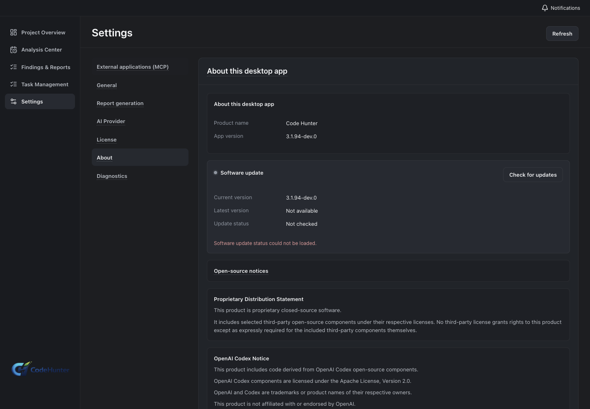
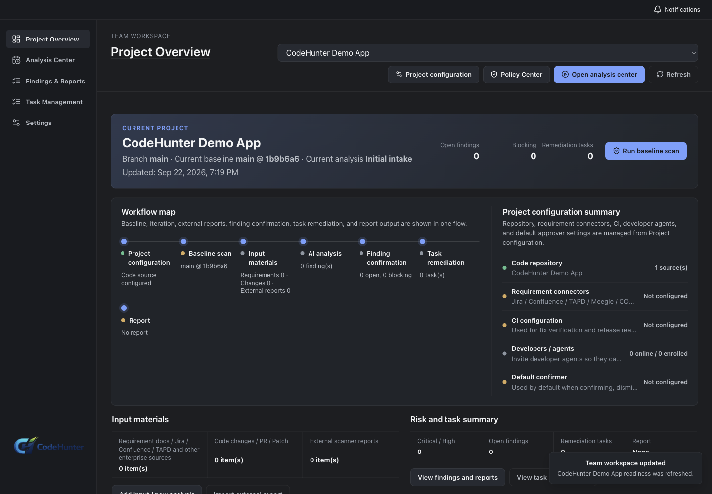
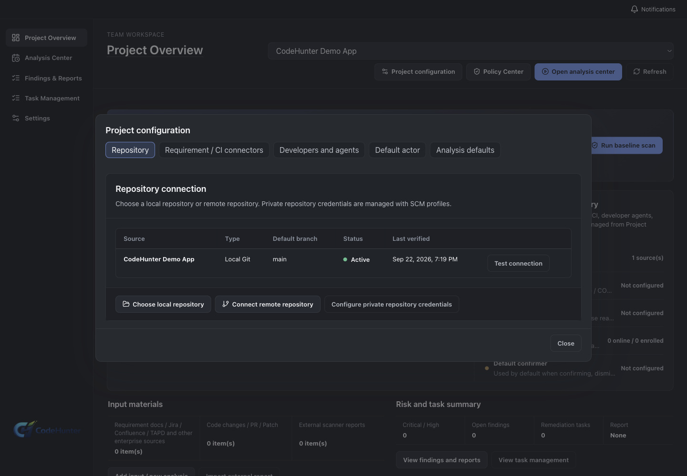
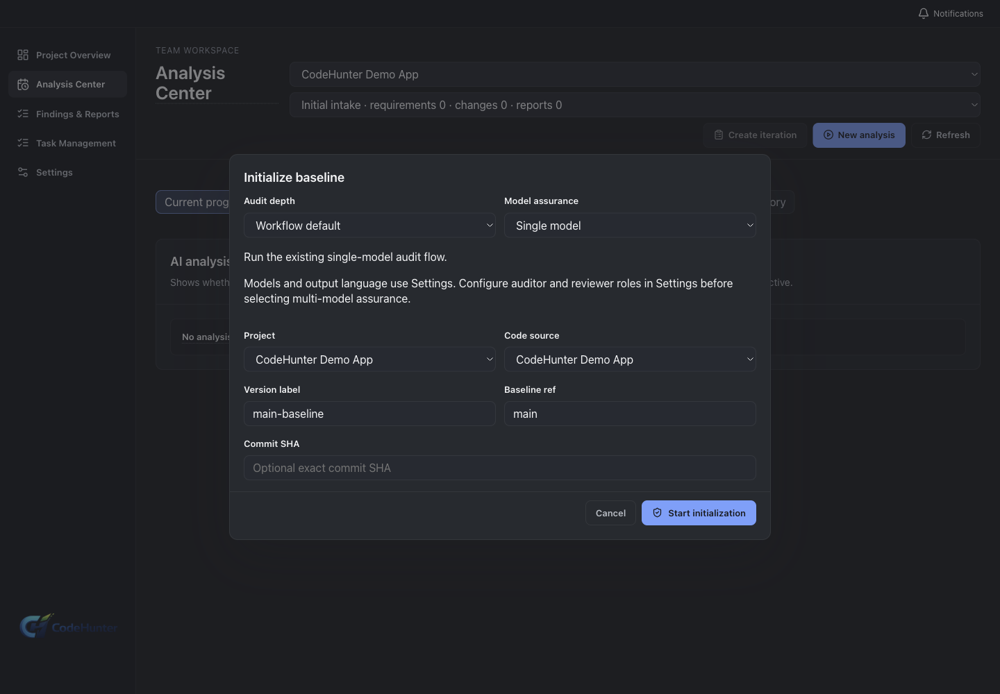
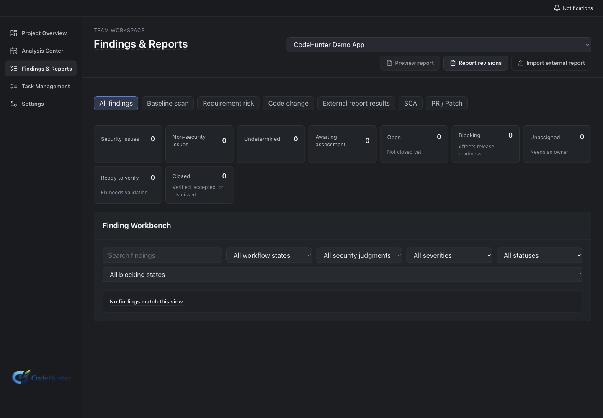
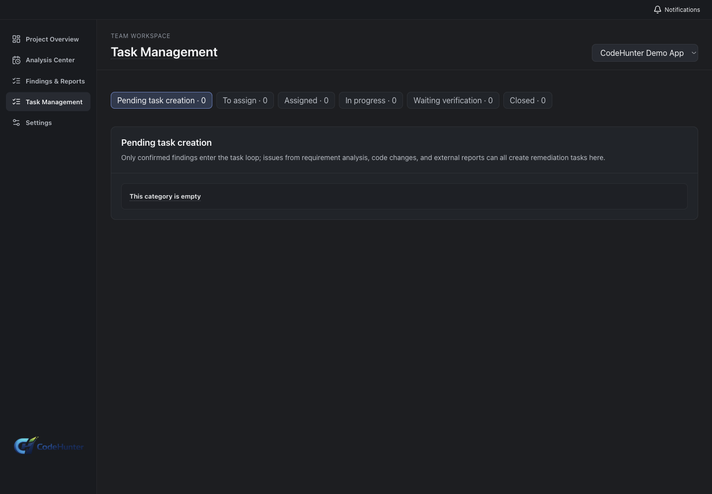
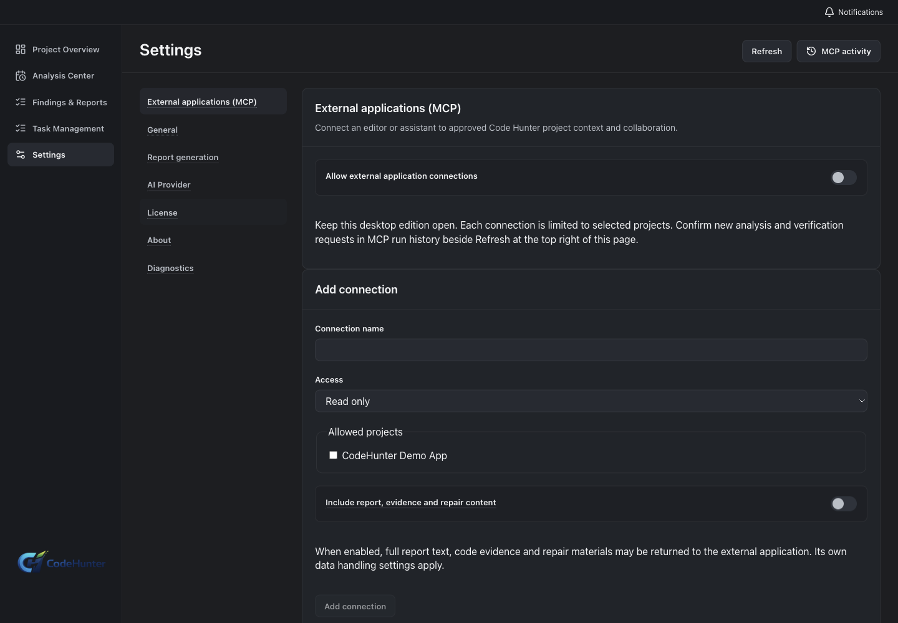

# Code Hunter Team 3.1.94: screenshot-backed tutorial

This is the English, user-facing workflow for **Code Hunter Team 3.1.94**. It describes the governance path from workspace and code source through baseline, iteration, triage, remediation, CI evidence, SCA, release readiness, Team MCP, and IDE developer tools. Screenshots are isolated renderer or plugin captures from the `3.1.94-dev.0` source baseline `e4b6868`; production workspace entitlement and native system-window actions are recorded separately in the evidence manifest.

The Team renderer capture was run with a separate Team development home and a neutral local Git project named `CodeHunter Demo App`. The corrected `team-dev` build exposes the Team project, code-source, baseline, analysis, findings, task, and MCP routes. The capture does not prove a production Team entitlement, remote SCM credential, or tenant-hosted workflow; the **Success state** text is the state to verify after signing in to an authorized Team workspace.

Each step states **Goal**, **Path**, **Enter or choose**, **Success state**, **Screenshot**, **Why it matters**, **If it fails**, and **Next**.

## Before you start

Use a Team account and workspace you are authorized to administer. Prepare a local demo repository, an approved SCM profile, an external SARIF/SAST sample if required, a dependency report, CI evidence, and a release owner. Never put a bearer token, basic-auth password, SSH private key, enrollment code, or real workspace data into a screenshot.

## 1. Download and identify Team

**Goal.** Confirm the Team desktop and version.

**Path.** Launch Code Hunter Team and open **Settings → About**.

**Enter or choose.** Confirm `Team`, `3.1.94`, and the expected channel. A development capture may show `3.1.94-dev.0`.

**Success state.** The Team edition is visible before workspace or license actions.

**Screenshot.**

**Why it matters.** Team owns workspace, role, source, baseline, task, gate, and Team MCP state that Personal does not expose.

**If it fails.** Quit and verify the installer; do not share a Personal catalog with Team.

**Next.** Open **Settings → License** and then the Team workspace selector.

## 2. Authenticate, activate, and enter the workspace

**Goal.** Establish the official Team entitlement and workspace access.

**Path.** **Settings → License → Sign in / Activate**, then select or create a permitted workspace.

**Enter or choose.** Use the official Team account or activation details and choose only workspaces assigned to that account.

**Success state.** The desktop shows a server-backed Team validation result, the workspace name, and the user role. Dev evidence may demonstrate only the screen and local route when no test entitlement is available.

**Screenshot.**

**Why it matters.** Workspace membership and role are the boundary for projects, findings, tasks, and release gates.

**If it fails.** Keep the exact visible error, verify account and workspace assignment, and contact the Team administrator. Do not edit local entitlement state.

**Next.** Open **Team Dashboard → Members**.

## 3. Add members and roles

**Goal.** Make review and remediation ownership explicit.

**Path.** **Team Dashboard → Members / Roles**.

**Enter or choose.** Add approved members and assign Security reviewer, Project owner, Developer / remediation owner, or other workspace roles supported by your tenant.

**Success state.** Each member can see the intended project and workflow areas, and role changes survive refresh.

**Screenshot.**

**Why it matters.** A Team finding without an owner is an alert list, not a remediation workflow.

**If it fails.** Check workspace permission and invite status. Ask an administrator instead of sharing a token.

**Next.** Open **Team Projects**.

## 4. Create the Team project and policy

**Goal.** Define one product or service boundary and its release policy.

**Path.** **Team Projects → New project**.

**Enter or choose.** Set project name, description, owner, default branch, release policy, and allowed source types. Keep unrelated repositories in separate projects.

**Success state.** The project appears in Team Dashboard, Baselines, Iterations, and Findings with the same owner and policy.

**Screenshot.**

**Why it matters.** Project identity is the join key for code sources, findings, tasks, SCA, reports, and release readiness.

**If it fails.** Check role and required fields. Do not continue with a project that has the wrong default branch.

**Next.** Create an SCM profile.

## 5. Configure an SCM profile and code source

**Goal.** Connect the project to an authorized source and prove ref access.

**Path.** **Settings → Providers / SCM → New SCM profile**, then **Team Project → Code sources → Add**.

**Enter or choose.** Select GitHub, GitLab, or Bitbucket. Choose bearer token, basic auth, or SSH key according to policy. Save the profile, create a code source, test the connection, and list branch, tag, commit, and PR/MR refs.

**Success state.** Connection test and ref listing succeed; the source card records provider, repository, and selected ref without exposing credentials.

**Screenshot.**

**Why it matters.** A saved credential does not prove that the intended source or revision can be materialized.

**If it fails.** Check token scope, SSH host policy, repository URL, network, and the exact error. Keep the token out of logs and screenshots.

**Next.** Choose local Git, remote Git, patch-only, or PR/MR source.

## 6. Select the source revision and initialize the baseline

**Goal.** Create the security reference at a verified revision.

**Path.** **Team Project → Baselines → New baseline**.

**Enter or choose.** Select the code source, branch/tag/commit or PR/MR, and the project scope. Confirm the revision is a branch, tag, or verified SHA, never a repository URL.

**Success state.** Baseline initialization completes with a run id, head commit, source type, report, findings, contracts, diff, and timeline.

**Screenshot.**

**Why it matters.** Every iteration delta and release decision is compared with this exact source state.

**If it fails.** Re-check the revision and source materialization. Rebuild the baseline from the intended ref instead of patching metadata.

**Next.** Inspect baseline report and promote only an accepted state.

## 7. Create an iteration and bind inputs

**Goal.** Represent a change cycle with coherent requirements, code, patches, PR/MR, and scanner inputs.

**Path.** **Iterations → New iteration**.

**Enter or choose.** Bind the baseline, requirement sources, code change or patch, PR/MR, and external report inputs that belong to this project and cycle.

**Success state.** The iteration workbench shows all input materials with their source, commit, and ownership.

**Screenshot.**

**Why it matters.** A delta finding is meaningful only when the change and its requirements are attributable to one iteration.

**If it fails.** Remove unrelated material, verify the project and commit, and refresh the workbench.

**Next.** Import external reports if your workflow uses a scanner.

## 8. Import SAST or SARIF and normalize findings

**Goal.** Bring external scanner evidence into Team with project, branch, commit, scanner, and date context.

**Path.** **External SAST → Import report**.

**Enter or choose.** Select SARIF or supported SAST format, scanner name, project, branch, commit, report date, and the file. Preview the import, bind it to the iteration, then run external report analysis.

**Success state.** The report is listed, normalized findings have stable ids, and source metadata is visible in the Findings workbench.

**Screenshot.**

**Why it matters.** Normalization makes scanner output attributable and reviewable without pretending that raw rows are accepted findings.

**If it fails.** Check format, JSON validity, project mapping, and commit. An empty result is an import or mapping failure until proven otherwise.

**Next.** Configure SCA policy.

## 9. Configure SCA, exceptions, and release gates

**Goal.** Make dependency policy and blocking conditions explicit.

**Path.** **SCA → Configuration / Policy**.

**Enter or choose.** Select dependency data source, severity and exploitability thresholds, license policy, blocking conditions, exception expiry, and owner approval requirements. Run the SCA closure for the selected project and iteration.

**Success state.** Dependency, advisory, license, fixed version, policy, and gate state are visible; an exception has an owner, rationale, and expiry.

**Screenshot.**

**Why it matters.** Release readiness needs a reproducible policy result rather than an informal spreadsheet or a hidden bypass.

**If it fails.** Check dependency source, lockfile, policy thresholds, and the selected iteration. Do not suppress a blocking dependency without an approved exception.

**Next.** Run requirement, impact, and delta analysis.

## 10. Run requirement and change analysis

**Goal.** Connect requirements, code changes, product impact, and security risk.

**Path.** **Iterations → Analysis Center**.

**Enter or choose.** Run requirement extraction, requirement impact, security analysis, owner review, change impact, delta generic risk, delta business risk, and delta finding review as appropriate for the inputs in this iteration.

**Success state.** Each stage has a status and evidence link, and the iteration does not show analysis for unrelated inputs.

**Screenshot.**

**Why it matters.** The stages explain why a change matters to the product, not only which rule matched a line.

**If it fails.** Inspect the missing input and stage error. Fix source mapping or requirement binding before retrying.

**Next.** Open the Findings workbench.

## 11. Review findings and assign owners

**Goal.** Turn normalized and model findings into owned work.

**Path.** **Findings → Findings workbench → Open finding**.

**Enter or choose.** Confirm source, affected area, evidence, severity, confidence, product impact, and remediation direction. Choose accept, reject, defer, downgrade, or accepted risk. Assign the owner and create a remediation task with acceptance criteria.

**Success state.** The finding decision, owner, task id, and acceptance criteria persist and appear in the project timeline.

**Screenshot.**

**Why it matters.** The owner and done condition are what make triage actionable.

**If it fails.** If ownership is missing, check project role mapping. If evidence is weak, defer or reject rather than assigning a speculative task.

**Next.** Open **Remediation Center**.

## 12. Claim a task and generate a remediation context pack

**Goal.** Give the developer a bounded context for repair.

**Path.** **Remediation Center → Task → Claim**, then **Generate context pack**.

**Enter or choose.** Claim the task as the assigned owner, review source files, evidence, acceptance criteria, related requirement, and test command, and generate the context pack.

**Success state.** The task shows the current owner, source-bound context, acceptance criteria, and test expectations.

**Screenshot.**

**Why it matters.** A repair should be generated from an accepted, source-bound task rather than an unbounded prompt.

**If it fails.** Check task ownership, project access, and source revision. Reject stale attempts and refresh the task history.

**Next.** Generate and preview a local fix package.

## 13. Generate, preview, apply, and verify a fix

**Goal.** Complete a reversible repair with test and PR evidence.

**Path.** **Task → Generate local fix package → Preview patch → Apply patch → Run tests**.

**Enter or choose.** Confirm the working tree checkpoint, selected finding/task, patch scope, rollback, assumptions, and test command. Apply only after the diff preview matches the acceptance criteria.

**Success state.** The patch is source-bound, tests run, the diff is reviewable, and the task records pending verification or verified fixed. To submit to source control, choose **Create PR/MR** only after tests pass and the owner has reviewed the diff.

**Screenshot.**

**Why it matters.** Fix generation, source application, tests, CI evidence, and verification are separate checkpoints.

**If it fails.** Roll back, attach the failure, and regenerate with narrower scope. Do not mark a finding fixed from a generated patch that was not applied and tested.

**Next.** Bind CI evidence to the same commit.

## 14. Bind CI evidence and check release readiness

**Goal.** Make the release decision from the same source and evidence chain.

**Path.** **Remediation / CI evidence**, then **Release Readiness**.

**Enter or choose.** Attach test and CI results, reviewer approval, PR/MR, commit, SCA state, open findings, exceptions, and verification records. Inspect **Blocked**, **Pending verification**, **Pass with risk**, or **Ready**.

**Success state.** CI evidence matches the source commit and the readiness panel explains every blocker or accepted residual risk.

**Screenshot.**

**Why it matters.** A green CI run for another commit must not satisfy the current release gate.

**If it fails.** Compare commit, branch, PR/MR, evidence timestamp, task status, and exception owner/expiry. Resolve the underlying mismatch.

**Next.** Promote a fresh baseline after the release decision.

## 15. Promote the fresh baseline

**Goal.** Start the next cycle from the accepted release state.

**Path.** **Release Readiness → Promote fresh baseline**.

**Enter or choose.** Select the accepted head commit and confirm the parent baseline and release record.

**Success state.** The new baseline timeline records the correct parent and head, and a new iteration can be created from it.

**Screenshot.**

**Why it matters.** Comparing the next release against a stale baseline hides regressions and repeats old work.

**If it fails.** Stop if the head or parent is wrong. Reopen the release record and choose the verified commit.

**Next.** Configure Team MCP and, if needed, the developer tools.

## 16. Configure and use Team MCP

**Goal.** Expose only the Team projects and materials that a local MCP client may read or request.

**Path.** **Settings → External Apps / MCP → Add connection**.

**Enter or choose.** Set a connection name, authorized Team projects, read-only or development collaboration mode, task-context and remediation-material scope, and whether reports/evidence/fix material are included. Copy the Team Codex or generic configuration and keep the matching Team desktop running.

**Success state.** Authorized project list, connector mode, material scope, and request history are visible. Development actions carry an idempotency key and remain subject to desktop confirmation and Team policy.

**Screenshot.**

**Why it matters.** Team MCP is a governed local connector, not an automation bypass.

**If it fails.** Verify the Team instance, project membership, connector version, and bridge process. Never reuse a Personal connector.

**Next.** Read project state, submit a task-context request, and inspect history.

## 17. Install Team developer tools 3.1.94

**Goal.** Connect the enrolled Team Agent to the IDE remediation workflow.

**Path.** Follow the [Team developer tools guide](../developer-tools/code-hunter-team/3.1.94/README.md). Install the VSIX in VS Code or the ZIP in JetBrains, then open Team **Agent Management**.

**Enter or choose.** Generate a one-time enrollment code, run the documented `enroll` command, and confirm `.codehunter/team-agent.toml` is created in the workspace. Keep the code private and expire it after enrollment.

**Success state.** The IDE shows CodeHunter Remediation Inbox and the agent status is enrolled for the selected Team project.

**Screenshot.** Native VS Code capture was not executed in this environment; see the [capture boundary](assets/3.1.94/developer-tools/CAPTURE_NOT_EXECUTED.md) and the manifest entry.

**Why it matters.** The IDE tool is a Team developer surface; it does not replace Team workspace authorization or the desktop release gate.

**If it fails.** Check package checksum, IDE version, platform binary, agent config path, and enrollment expiry. Do not copy a Team token into Personal configuration.

**Next.** Refresh tasks and claim a remediation item.

## 18. Use the VS Code or JetBrains remediation inbox

**Goal.** Refresh, claim, generate, preview, apply, test, and hand off a Team fix from the IDE.

**Path.** **CodeHunter Remediation Inbox → Refresh tasks → Claim task → Generate fix → Preview patch → Apply patch → Run tests → Create PR**.

**Enter or choose.** Review the task, context pack, patch and rollback, test command, and PR target. Confirm every action that changes the working tree or remote source control.

**Success state.** Task state, patch preview, test result, and PR handoff are linked to the same Team task and source commit. The JetBrains tool window exposes the equivalent refresh and configuration entry points.

**Screenshot.** Native JetBrains capture was not executed in this environment; see the [capture boundary](assets/3.1.94/developer-tools/CAPTURE_NOT_EXECUTED.md) and the manifest entry.

**Why it matters.** The IDE shortens the developer loop while keeping Team policy, ownership, evidence, and confirmation in the control plane.

**If it fails.** Check agent logs and config, refresh task state, and return to the Team desktop when a policy or approval action is required.

## Team troubleshooting map

| Symptom | First check | Safe recovery |
| --- | --- | --- |
| SCM connects but baseline cannot materialize | Source ref, commit, token scope, local workspace | Recreate from a verified branch/tag/SHA |
| External report is empty | Format, project mapping, branch and commit | Preview the import and rebind it to the iteration |
| Finding has no owner | Workspace role and project owner mapping | Assign an approved remediation owner |
| CI evidence does not match | Commit, PR/MR, branch, timestamp | Attach evidence from the exact release commit |
| SCA gate is blocked | Advisory, severity, exploitability, license, exception expiry | Fix dependency or record an approved time-bounded exception |
| Exception lacks owner | Approval and expiry fields | Add owner and rationale; do not bypass the gate |
| Baseline points to wrong branch | Baseline head and source ref | Rebuild and promote from the intended revision |
| MCP lists the wrong projects | Team connector, workspace membership, running instance | Revoke, recreate with scoped project access |
| Agent cannot refresh tasks | Package checksum, enrollment, config path, desktop version | Re-enroll against the matching Team desktop |

## Team completion checklist

- [ ] Team entitlement and workspace role are server-backed or explicitly marked as dev-only UI evidence.
- [ ] Project owner, default branch, release policy, and SCM profile are visible.
- [ ] Code source ref and baseline head commit are verified.
- [ ] Iteration inputs are attributable to one project and commit.
- [ ] External report and SCA states are normalized and policy-bound.
- [ ] Findings have evidence, decisions, owners, tasks, and acceptance criteria.
- [ ] Patch, tests, CI, verification, and PR/MR use the same source commit.
- [ ] Release readiness is explained and fresh baseline promotion is recorded.
- [ ] Team MCP permissions and idempotent request history are visible.
- [ ] VS Code and JetBrains packages match 3.1.94 and pass checksum/layout checks.
