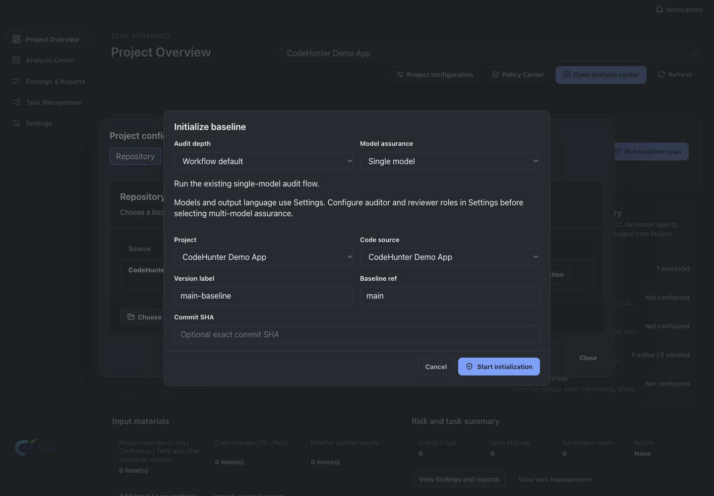

# Team: Baseline and Iteration

A Baseline records the starting state of a Team project. An Iteration records the requirements, changes, findings, and verification work for a later change.

## Initialize a baseline

1. Open **Baseline**.
2. Select the project code source and revision.
3. Start baseline initialization.
4. Wait for the baseline status to become available.

## Create an iteration

1. Open **Iterations**.
2. Choose **New iteration**.
3. Bind the requirement, code change, patch, or PR/MR.
4. Save the iteration.
5. Use the timeline and diff views to check the selected change.

### Result

The project has a recorded baseline and an iteration that points to a specific change set.

### Common issue

If the baseline cannot be materialized, verify the selected branch or commit and test the code source again.
